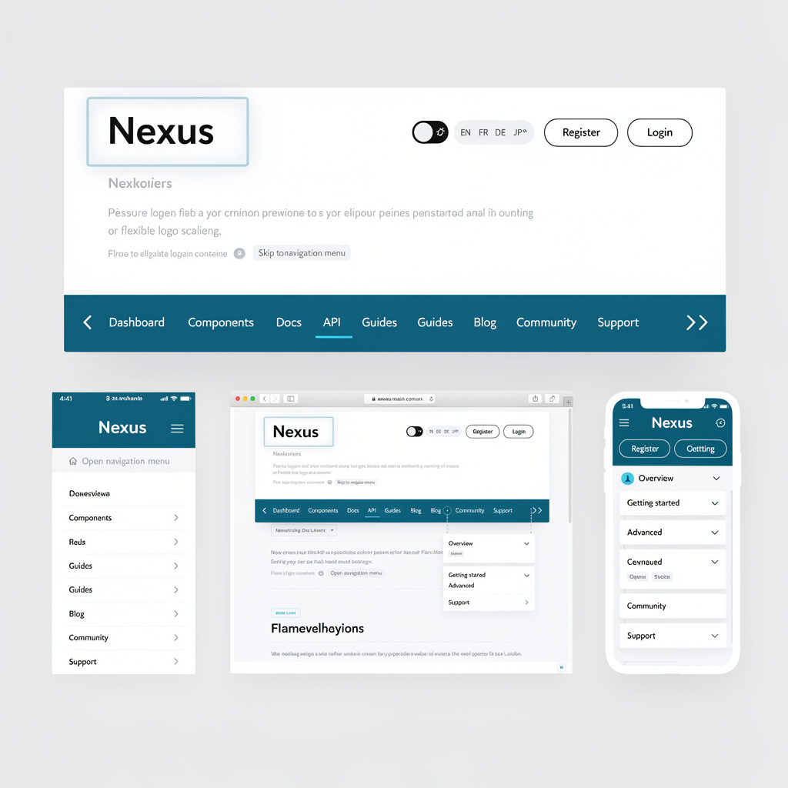
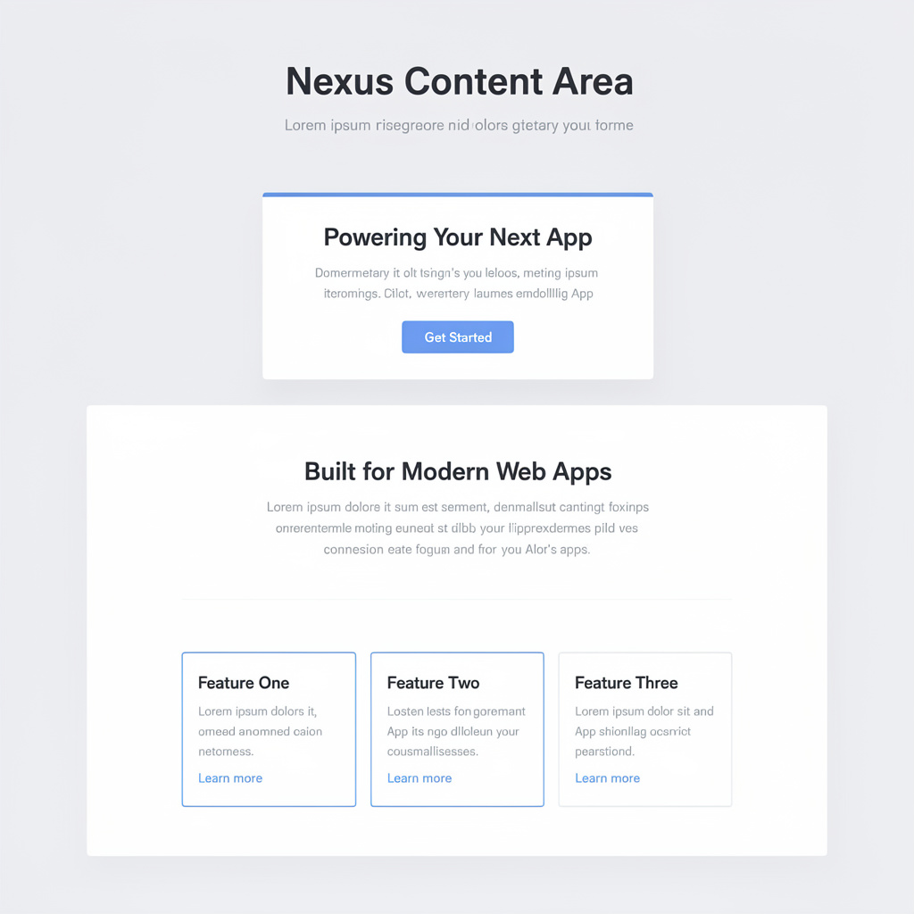
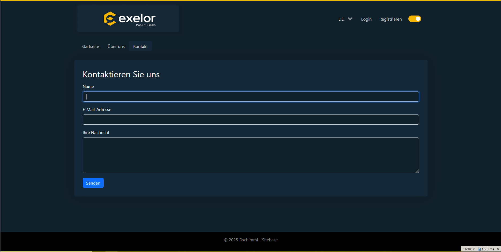

# Pflichtenheft: Projekt Nexus

---

## 1. Einleitung und Zielbestimmung
(Umfasst den Zweck dieses Dokuments, die übergeordneten Projektziele und den Geltungsbereich.)

### 1.1. Zweck des Dokuments
Dieses Pflichtenheft (PH) definiert die verbindliche technische und organisatorische Grundlage für die Entwicklung des "Nexus"-Frameworks. Es dient als detaillierte technische Antwort auf die Anforderungen des Lastenhefts (LH) und übersetzt das dort formulierte "Was" (die Anforderungen des Auftraggebers) in ein konkretes "Wie" und "Womit" (die Lösungsstrategie und Spezifikation des Auftragnehmers).

### 1.2. Übergeordnetes Projektziel
Das übergeordnete Ziel des Projekts "Nexus" ist die Schaffung einer einheitlichen, modernen, sicheren und wartbaren technologischen Basis, um die im Lastenheft beschriebene heterogene und pflegeintensive Systemlandschaft abzulösen. Die neue Basis soll den Entwicklungs- und Wartungsaufwand signifikant reduzieren, die Sicherheit und Performance erhöhen und eine konsistente, erweiterbare Grundlage für zukünftige Webprojekte bieten.

### 1.3. Geltungsbereich und Abgrenzung
Der Geltungsbereich dieses Pflichtenhefts und des damit verbundenen Projekts umfasst ausschließlich die Konzeption und Implementierung des Nexus-Base Frameworks bis zur Freigabe der stabilen Version 1.0.0.

Die Entwicklung der in den Kapiteln PH: 4.2 und PH: 4.3 beschriebenen Erweiterungs- und Spezialmodule (z.B. Userverwaltung, Forum) ist explizit nicht Teil dieses Projekts. Diese Module dienen in diesem Dokument als konzeptionelle Beispiele, um die Erweiterbarkeit und die Architektur des Basisframeworks zu validieren, werden aber in nachgelagerten, eigenständigen Projekten umgesetzt.

---
## 2. IST-Zustand und Problemanalyse
`(Detaillierte Analyse der bestehenden Systemlandschaft und der daraus resultierenden Herausforderungen.)`

### 2.1. Bestehende Systemlandschaft
Die aktuelle technologische Basis besteht aus fünf voneinander unabhängigen und technologisch heterogenen Web-Systemen, die produktiv eingesetzt werden. Diese sind:
1.	Ein MediaWiki als themenspezifisches Online-Lexikon.
2.	Ein phpBB-Forum als Community-Plattform, das nur lose und unzureichend angebunden ist.
3.	Ein eigenentwickeltes CMS, das Partnern zur eigenständigen Verwaltung von Inhalten und Werbung dient.
4.	Ein "Frachtbriefgenerator", der als HTML-Formular Benutzereingaben in ein PDF-Dokument umwandelt.
5.	Eine NDA-belegte "preAlpha"-Anwendung.
Die technologische Grundlage dieser Systeme ist fragmentiert und umfasst unter anderem PHP, JavaScript, SQL/PDO, AJAX, HTML und CSS.

### 2.2. Problemanalyse
Aus dem beschriebenen IST-Zustand resultieren mehrere schwerwiegende Probleme, die die Wartbarkeit, Sicherheit und Weiterentwicklung der Systeme erheblich erschweren:
- Hoher redundanter Aufwand: Wiederkehrende Aufgaben, wie die Implementierung eines DSGVO-konformen Cookie-Banners oder die Umsetzung von Sicherheitsupdates, müssen für jedes System einzeln und mit hohem Mehraufwand durchgeführt werden.
- Fehlende Integration und Inkonsistenz: Es existieren keine standardisierten Prozesse oder echten Schnittstellen zwischen den Plattformen. Die Benutzerverwaltung ist dezentral, was zu inkonsistenten Datenbeständen und einem schlechten Benutzererlebnis führt.
- Sicherheits- und Performance-Defizite: Durch die heterogene Landschaft werden Sicherheits- und Performance-Aspekte nicht systematisch, sondern improvisiert und reaktiv behandelt, was ein erhebliches Risiko darstellt.
- Erschwerte Wartung und Weiterentwicklung: Die Pflege von fünf unterschiedlichen Codebasen ist extrem zeitintensiv, fehleranfällig und verhindert eine agile Weiterentwicklung. Jede noch so kleine Anpassung birgt das Risiko von unvorhergesehenen Seiteneffekten in den jeweiligen Altsystemen.

**Fazit:** Der aktuelle Zustand ist wirtschaftlich ineffizient, technisch nicht zukunftsfähig und sicherheitstechnisch bedenklich. Die Entwicklung des "Nexus"-Frameworks ist die strategische Antwort, um diese grundlegenden Probleme zu lösen.

---
## 3. SOLL-Konzept: Systemarchitektur und technischer Lösungsansatz
`(Beschreibung der grundlegenden Architektur des "Nexus"-Frameworks, des Technologie-Stacks und der zentralen Design-Entscheidungen.)`

Dieses Kapitel beschreibt die grundlegende technische Architektur und die zentralen Design-Entscheidungen für das "Nexus"-Framework. Die hier vorgestellte Architektur ist die direkte technische Antwort auf die im IST-Zustand (Lastenheft, S. 2) identifizierten Herausforderungen – insbesondere die Heterogenität der Systeme, der hohe Wartungsaufwand und die fehlenden zentralen Komponenten wie eine einheitliche Userverwaltung. Das Ziel ist die Schaffung einer einheitlichen, modularen und flexiblen Framework-Basis, wie im SOLL-Zustand gefordert.

### 3.1. Kern-Technologie-Stack
Der Technologie-Stack ist so gewählt, dass er die im Lastenheft geforderten Ziele wie Sicherheit, Wartbarkeit, Performance und Flexibilität bestmöglich unterstützt.

#### 3.1.1. Programmiersprache: PHP 8.2+
Die Festlegung auf eine aktuelle PHP-Version ist eine strategische Entscheidung, um die im Lastenheft geforderte hohe Qualität und Sicherheit zu gewährleisten. Moderne Sprachfeatures und strikte Typisierung reduzieren die Fehleranfälligkeit und verbessern die Wartbarkeit, was direkt das Problem des "aufwändigen und fehleranfälligen" IST-Zustands adressiert.

#### 3.1.2. Webserver: Nginx / Apache 2.4+ mit URL-Rewriting
Das Framework wird über einen einzigen Einstiegspunkt (eine index.php im /public-Verzeichnis) betrieben. Dies ist ein fundamentaler Bruch mit den bisherigen, separaten Installationen und die technische Voraussetzung für eine zentrale Steuerung von Anfragen, Sicherheit und Konfiguration.

#### 3.1.3. Datenbank-Schnittstelle: PHP Data Objects (PDO)
Um die im Lastenheft (S. 1) explizit geforderte Unabhängigkeit von spezifischen Datenbanksystemen zu erreichen, wird ausschließlich die PDO-Schnittstelle verwendet. Dies stellt sicher, dass das "Nexus"-Framework zukünftig flexibel mit unterschiedlichen Datenbanken (primär MySQL und PostgreSQL) arbeiten kann, ohne dass der Kern des Frameworks angepasst werden muss.

#### 3.1.4. Abhängigkeitsmanagement: Composer 2.x
Die im Lastenheft geforderte Modularität und Erweiterbarkeit wird technisch durch den Einsatz von Composer als zentralem Werkzeug für das Management von Bibliotheken und Framework-eigenen Modulen umgesetzt.

### 3.2. Architekturmuster: Hexagonale Architektur (Ports & Adapters)
Um die zentrale Herausforderung – die Schaffung einer einzigen Codebasis für verschiedene Anwendungen (Wiki, Forum, CMS etc.) – zu lösen, wird eine Hexagonale Architektur, geleitet von den Prinzipien des Domain-Driven Design (DDD), implementiert.

Dieses Muster trennt den Anwendungskern (Business-Logik) strikt von der Außenwelt (UI, Datenbank, externe APIs). Dies ermöglicht es uns, für dieselbe Kernlogik unterschiedliche "Adapter" zu erstellen. So kann beispielsweise die zentrale Userverwaltung (Kernlogik) sowohl von einem Web-Controller (für das CMS) als auch von einer API (für eine zukünftige App) genutzt werden, ohne Code zu duplizieren.

#### 3.2.1. Domain-Schicht (Der Kern):
Inhalt: Enthält die reine Business-Logik und die Geschäftsregeln, z.B. was ein User ist oder welche Regeln für einen CMR-Frachtbrief gelten.

Zweck: Diese Schicht ist komplett unabhängig von jeder Technologie. Sie ist das wiederverwendbare Herzstück des "Nexus"-Frameworks.

#### 3.2.2. Application-Schicht (Die Anwendungsfälle):
Inhalt: Orchestriert die Domain-Logik, um konkrete Anwendungsfälle abzubilden (z.B. RegistriereNeuenNutzer, ErstelleFrachtbriefPDF).

Zweck: Definiert, was die Software tun kann. Bildet die Schnittstelle zwischen der Außenwelt und dem Kern.

#### 3.2.3. Infrastructure-Schicht (Die Adapter "nach außen"):
Inhalt: Enthält die konkreten Implementierungen für externe Abhängigkeiten: Datenbank-Repositories (z.B. PostgresUserRepository), PDF-Generatoren, E-Mail-Versanddienste etc.

Zweck: Macht die Außenwelt für den Kern nutzbar. Diese Schicht ist austauschbar. Wir können von MySQL auf PostgreSQL wechseln, indem wir lediglich einen Adapter in dieser Schicht austauschen, ohne den Kern anzufassen.
#### 3.2.4. Presentation-Schicht (Die Adapter "nach innen"):
Inhalt: Empfängt Anfragen von außen. Dies können Web-Controller, API-Endpunkte oder Konsolen-Befehle sein.

Zweck: Dient als Einstiegspunkt für Benutzer und externe Systeme. Für jedes "alte" Projekt (Wiki, Forum) wird hier ein eigener Satz von Controllern und Views erstellt, die alle auf dieselbe Application- und Domain-Schicht zugreifen.

Dieses Modell adressiert direkt die im Lastenheft geforderte Wiederverwendbarkeit, einfache Erweiterbarkeit und Reduktion des Pflegeaufwands.

### 3.3. Auswahl von Kern-Bibliotheken und Komponenten
Das "Nexus"-Framework wird kein monolithisches Fremd-Framework nutzen, sondern nach dem Baukastenprinzip auf bewährten, einzelnen Komponenten aufbauen. Dies stellt sicher, dass der Kern des Frameworks schlank bleibt und nicht "überladen oder unnötig spezialisiert" wird (Lastenheft, S. 1).

#### 3.3.1. Dependency Injection Container: Symfony DI
Um die lose Kopplung der Komponenten und die Testbarkeit sicherzustellen, wird der DI-Container von Symfony verwendet. Er ist für die zentrale Verwaltung und das "Verdrahten" aller Dienste verantwortlich.

#### 3.3.2. HTTP-Abstraktion und Routing: Symfony HttpFoundation & Routing
Diese Komponenten handhaben die Verarbeitung von HTTP-Anfragen und -Antworten sowie das Mapping von URLs auf die zuständigen Controller in der Presentation-Schicht. Ihre Flexibilität erlaubt es, die Anforderungen von einfachen Landing-Pages bis hin zu komplexen Anwendungen abzudecken.

#### 3.3.3. Template-Engine: Twig
Um eine strikte Trennung von Logik und Darstellung zu gewährleisten, wird Twig als Template-Engine eingesetzt. Seine Vererbungs- und Inklusionsmechanismen unterstützen die im Lastenheft geforderte Wiederverwendbarkeit von Design-Elementen.

#### 3.3.4. Logging-Schnittstelle: Tracy ILogger
Wie in den Coding Guidelines (9.1.1) festgelegt, dient die ILogger-Schnittstelle von Tracy als zentraler Logging-Mechanismus, der per Dependency Injection in alle relevanten Dienste injiziert wird.

---
## 4. Funktionale Anforderungen im Detail
`(Spezifikation der einzelnen Funktionen, unterteilt in die im Lastenheft genannten Kategorien.)`

### 4.1. Basisframework (Core Application Scaffolding)
Das Basisframework enthält ausschließlich die Komponenten, die für den Betrieb einer sicheren, performanten und DSGVO-konformen Webanwendung zwingend erforderlich sind, ohne jegliche anwendungsspezifische Logik wie eine Benutzer- oder Inhaltsverwaltung. Es ist die technische Grundlage, auf der alle späteren Module aufsetzen.

#### 4.1.1. Seiten-Rendering und Template-Management
Spezifikation: Das Framework stellt einen Mechanismus bereit, um Anfragen über die Routing-Komponente (siehe 3.3.2) an einen Controller zu leiten, der ein Twig-Template (siehe 3.3.3) rendert und als HTML-Seite ausliefert. Es existiert keine datenbankgestützte Inhaltsverwaltung im Basisframework. Die Templates selbst sind flexibel und können von späteren Modulen dynamisch mit Inhalten befüllt werden.

Begründung: Erfüllt die Kernanforderung, statische und templetisierte HTML-Seiten anzeigen zu können. Dies bildet das Fundament für jede Art von Web-Anwendung, von der einfachen Landing-Page bis zum komplexen Portal.

#### 4.1.2. Sichere Session-Verwaltung (Service-Spezifikation)

Spezifikation: Die Session-Verwaltung ist eine kritische Sicherheitskomponente des Basisframeworks. Sie darf nicht als einfacher Wrapper um die globale $_SESSION-Variable implementiert sein, sondern muss als objektorientierter Service (SessionService) realisiert werden, der Daten strukturiert, isoliert und schützt. Dieser Service gewährleistet eine saubere Isolation, Manipulationssicherheit, Austauschbarkeit des Speichers und vollständige Kontrolle über Laufzeiten, Fingerprinting und Sicherheitsmechanismen (Session-Hijacking,  Fixation-Schutz u.a.). Die folgenden Anforderungen definieren den verbindlichen Mindeststandard für Implementierungen.

Architekturgrundsätze

Der SessionService arbeitet vollständig unabhängig vom Anwendungscode, definiert strukturierte “Attribute Bags” als isolierte logische Container und nutzt das native SessionHandlerInterface, um den Speichermotor (Datei, Redis, DB) ohne Codeänderungen austauschbar zu machen. Eine Session repräsentiert niemals den Authentifizierungsstatus eines Nutzers; Login-Zustände liegen ausschließlich im Security-Bag und werden nur vom AuthenticationService verwaltet.

Die Session-ID muss mindestens 128 Bit Entropie aufweisen (z. B. 32 Zeichen bei Base64-Codierung). Es wird `random_bytes()` für die Generierung genutzt, um kryptografisch sichere Zufallswerte zu gewährleisten. `$sessionId = bin2hex(random_bytes(32));`

Verbindliche Anforderungen:

- Attribute Bags (Daten-Isolation):
  - Um Kollisionen zwischen verschiedenen Modulen zu verhindern, muss der Service Session-Daten in logisch getrennten Containern ("Bags") verwalten:
  - Security Bag: Reservierter Bereich für Authentifizierungsdaten (User-ID, RBAC-Snapshot) inklusive einer versionsbasierten Kennung (security_version), die bei jedem Login erhöht wird, um parallele veraltete Sessions automatisch zu invalidieren. Damit werden Replay-Angriffe bei veralteten Sessions ausgeschlossen. Schreibzugriff darf nur durch den AuthenticationService erfolgen.
  - Attribute Bag: Bereich für allgemeine Benutzer-Einstellungen (z.B. Sprache, Darkmode-Präferenz) sowie für anwendungsbezogene Zähler wie Login-Rate-Limits, um z.B. Login-Bruteforce abzufangen.
  - Flash Bag: Bereich für temporäre Nachrichten (Erfolg/Fehler), die nach dem einmaligen Auslesen automatisch gelöscht werden ("Auto-Expire"), auch tab-sicher ohne unbeabsichtigte Mehrfach-Löschung. Der Service sorgt für race-condition-freies Speichern und Auslesen durch atomare Schreiboperationen über den SessionHandler.

- Sicherheits-Methoden:
  - Migration: Die Methode `regenerateId()` muss implementiert sein und zwingend bei jeder Änderung des Privilegien-Levels (Login, Logout, Passwortänderungen, Rollenwechsel oder sensiblen Transaktionen (z. B. Zahlungen) etc.) ausgeführt werden, um Session-Fixation-Angriffe zu unterbinden. Die Methode `regenerateId()` darf lediglich die Session-ID rotieren, nicht die Cookie-Lebensdauer unerlaubt verlängern.
  - Invalidate: Eine Methode invalidate() muss existieren, die die Session serverseitig zerstört und das Session-Cookie clientseitig ungültig macht, sie setzt alle Bags zurück und protokolliert den Vorgang. 
  - Fingerprinting: Der Service muss beim Start einen Hash aus
   1. Browser-Familie
   2. Major-Version
   3. Betriebssystem-Plattform
   4. Anonymisierter IP-Adresse (IPv4 /24 und IPv6 /64)
   5. Optional (wegen Datenschutz) kann die ungefähre Geolokation (z. B. Land/Region) in den Fingerprint einbezogen werden, um ungewöhnliche Standorte zu erkennen. Falls genutzt wird aus Datenschutzgründen die Geolokation nur als Hash gespeichert.
   6. Es wird kein gehashter UA-String genutzt, da dieser manipuliert sein könnte.
   bilden und bei jedem Request prüfen. Bei Abweichung wird die Session invalidiert. Der Vergleich erfolgt zeitkonstant (hash_equals()), um Timing-Leaks zu vermeiden. Das Fingerprinting muss konfigurierbar deaktivierbar sein (z. B. für Geräte mit wechselnden Mobilnetzen).
  - Anti-Replay: Neben der Session-ID muss ein serverseitiges Nonce/Tokensystem im Security-Bag existieren.
  - Bei Login wird security_version erhöht. Ältere Sessions desselben Nutzers werden dadurch ungültig. Jede aktive Session eines Nutzers muss anhand der security_version global invalidierbar sein.

- Storage-Abstraktion:
  - Der Service muss auf dem nativen SessionHandlerInterface basieren. Dies stellt sicher, dass der Speicherort der Sessions bei Bedarf (z.B. für Loadbalancing) vom Dateisystem auf Redis oder eine Datenbank umgestellt werden kann, ohne den Applikationscode anzupassen.
  - Datenschutz: Es ist sicherzustellen, dass der Speicherdienst (Redis/DB) durch Infrastruktur-Maßnahmen (TLS, Private Network, Passwort/ACL) gegen unbefugten Zugriff gesichert ist.
  - Der Serializer darf nicht PHP-serialize verwenden. JSON ist verpflichtend, um Unserialize-Injections auszuschließen.
  - Schreiboperationen müssen atomar erfolgen. 
  
  Bei Redis Nutztung
  - sind entsprechende Lock-Mechanismen (SET NX + Expire) sicherzustellen.
  - ist die Redis-Authentifizierung und TLS-Verschlüsselung für die Verbindung zu verwenden.
  - Der `protect-mode` muss in Redis auf `yes` gesetzt sein, um unbefugten Zugriff zu verhindern.

- Cookie-Konfiguration:
  - Die Session-Cookies müssen zentral konfigurierbar sein und standardmäßig die sichersten Flags nutzen: HttpOnly (kein JS-Zugriff), Secure (nur HTTPS) und SameSite=Strict (CSRF-Schutz).
  - Name Obfuscation: Der Name des Session-Cookies darf nicht PHPSESSID lauten. Er muss konfigurierbar sein oder standardmäßig einen zufälligen Hash-Wert (z.B. Präfix + Random String) verwenden, um Framework-Fingerprinting zu erschweren.
  - Es wird empfohlen das Präfix auf `__Host` zu setzen um sicherzustellen, dass sie nur für die aktuelle Domain gelten und nicht von Subdomains ausgelesen werden können.
  - Sessions dürfen niemals über URL-Parameter übertragen werden; use_trans_sid muss deaktiviert sein. `session.use_trans_sid = 0`
  - Session-ID darf niemals via GET/POST akzeptiert werden.
  - In Sonderfällen (z. B. Single-Sign-On) darf "SameSite=Lax" genutzt werden. Dies sollte konfigurierbar sein oder Systemseitig erkannt werden.

- Lifetime-Management & Garbage Collection:
  - Strict Idle Timeout: Der Service muss den Zeitstempel des letzten Zugriffs (last_activity) in der Session speichern. Überschreitet die Inaktivität einen definierten Wert (z.B. 30 Minuten), muss die Session beim nächsten Request aktiv invalidiert werden, unabhängig von der PHP-internen Garbage Collection.
  - Absolute Max Lifetime: Optional muss eine absolute Obergrenze konfigurierbar sein (z.B. 12 Stunden), nach der eine Session zwangsweise beendet wird, auch bei Aktivität.
  - Cookie Lifetime: Die Lebensdauer des Session-Cookies muss synchron zum Idle-Timeout konfiguriert sein (typischerweise 0 = Browser-Session oder identisch zum Timeout).
  - Der SessionService darf nicht darauf vertrauen, dass PHPs Garbage-Collection zuverlässig läuft; alle Prüfungen müssen explizit durch den Service erfolgen.

- CSRF-Schutz:
  - Das CSRF-Token wird vom SessionService automatisch erzeugt.
  - Der SessionService verwaltet das stabil an die Session gekoppelte CSRF-Token.
  - Per-Formular-Tokens (Double-Submit) müssen unterstützt werden.
  - Alle Tokens müssen im Security Bag liegen.

- Ereignisprotokollierung:
  - Der Service muss sicherheitsrelevante Aktionen in strukturierter Form (JSON) loggen, darunter Session-Migration, Session-Invalidation, Timeout-Invalidation, Fingerprint-Mismatch, security_version-Konflikte, CSRF-Token-Fehler sowie ungewöhnliche Session-ID-Wiederverwendungen.
  - Zu jeder Sicherheitsrelevanten Aktion werden folgende Metadaten geloggt: IP-Adresse (anonymisiert), User-Agent, Zeitstempel und Session-ID (gehasht).
  - Der SessionService muss "ungewöhnliche Muster" (Anomalien) erkennen können. Hierzu Zählen bspw. mehrere Session-Regenerationen in kurzer Zeit, weitere Anomalien sind in "00040.1 Anhang Anomalien.md" aufgeführt.

- Multi-Tab- & Race-Condition-Sicherheit:
  - Es wird ein Timestamp `$_SESSION['_version'] = time();` in der Session verwendet, um Race Conditions zu erkennen. Vor jedem Schreibzugriff wird geprüft ob die Version noch aktuell ist.
  - Flash Messages müssen tab-sicher sein. Dafür werden unique IDs für Flash-Messages genutzt, um sicherzustellen, dass sie nur einmal pro Tab angezeigt werden.
  - Parallele Requests dürfen sich nicht gegenseitig überschreiben. 
  - Atomare Schreibvorgänge müssen sichergestellt sein.

- Kontextsteuerung:
  - Im CLI-Kontext darf keine Session automatisch geöffnet werden.
  - Web-APIs, Controller oder UseCases dürfen Sessions nur per explizitem Opt-In aktivieren.
  - Der SessionService muss global deaktivierbar sein (z.B. für APIs oder CLI-Skripte).
  - Es werden umgebungsbezogene (Dev, Staging, Prod) Einstellungen verwendet um z.B. Fingerprinting nur in Produktion aktivieren.

#### 4.1.3. Internationalisierung (i18n)
Spezifikation: Das Framework stellt einen zentralen "Translator"-Service bereit. Dieser Service implementiert eine definierte Schnittstelle (TranslatorInterface).
- Im Basisframework wird dieser Service mit einem Provider konfiguriert, der Sprachstrings aus einfachen PHP-Dateien (/translations/de.php, /translations/en.php) lädt.
- Die Schnittstelle ist so konzipiert, dass spätere Module eigene Provider (z.B. einen DatabaseTranslationProvider) registrieren können, die ihre Übersetzungen aus Datenbanktabellen laden. Das System aggregiert dann die Übersetzungen aus allen Quellen.

Begründung: Schafft eine flexible und erweiterbare Lösung für die Mehrsprachigkeit, die von einfachen Konfigurationsdateien bis hin zu komplexen, datenbankgestützten Übersetzungsmodulen skaliert.

#### 4.1.4. DSGVO- und Compliance-Mechanismen
Spezifikation: Das Basisframework enthält einen zentralen Service zur Verwaltung von Benutzerzustimmungen (Cookie-Consent). Dieser Service stellt Funktionen bereit, um den Status der Zustimmung abzufragen und zu speichern (unter Nutzung des Session-Services aus 4.1.2). Ein rudimentäres Cookie-Banner (HTML/JS), dessen Inhalte über die i18n-Komponente (4.1.3) verwaltet werden, ist Teil des Basisframeworks.

Begründung: Gewährleistet, dass jede auf "Nexus" basierende Anwendung die grundlegenden gesetzlichen Anforderungen an den Datenschutz von Beginn an erfüllen kann.

#### 4.1.5. Performance- und Sicherheitsgrundlagen
Spezifikation: Beinhaltet die bereits in der Architektur (Kapitel 3) und den Coding Guidelines (Kapitel 9) definierten Grundlagen wie Schutz vor XSS, CSRF (Token-Generierung ist im Session-Service verankert), SQL-Injection, einheitliches Logging mit Tracy und eine klare Konfiguration für Caching-Mechanismen (Opcode-Caching).

Begründung: Stellt sicher, dass das Fundament des Frameworks den nicht-funktionalen Anforderungen an Sicherheit und Performance genügt.

#### 4.1.6. SEO-Grundlagen (Search Engine Optimization)
Spezifikation:
Das Basisframework muss die technischen Grundvoraussetzungen für eine effektive Suchmaschinenoptimierung bereitstellen, um die Auffindbarkeit der darauf basierenden Webseiten sicherzustellen. Dies umfasst die folgenden Kernfunktionen:
- Meta-Tag-Management: Die Template-Engine und die Controller-Struktur müssen es ermöglichen, für jede gerenderte Seite einen individuellen <title>-Tag und eine <meta name="description"> zu setzen.
- Sitemap-Generierung: Das Framework muss einen Mechanismus (z.B. einen Konsolenbefehl oder einen dedizierten Controller) bereitstellen, der eine sitemap.xml-Datei gemäß dem offiziellen Standard generiert. Diese Sitemap listet alle öffentlichen Seiten der Anwendung auf.
- robots.txt-Management: Das Framework muss im /public-Verzeichnis eine standardmäßige robots.txt-Datei bereitstellen, die gängige "Good Practices" umsetzt (z.B. das Disallow von System-Verzeichnissen). Diese Datei muss anpassbar sein.
- Canonical URLs: Das Framework muss für jede Seite automatisch einen rel="canonical" Link-Tag im HTML-<head> generieren, der auf die primäre, saubere URL der jeweiligen Seite verweist, um Probleme mit Duplicate Content zu vermeiden.

Begründung:
Die Implementierung dieser On-Page-SEO-Grundlagen ist entscheidend, um die Sichtbarkeit und den Erfolg der mit Nexus erstellten Webprojekte in Suchmaschinen zu gewährleisten. Während die nicht-funktionalen Anforderungen bereits eine SEO-freundliche technische Basis schaffen, stellen diese Funktionen die notwendigen Werkzeuge zur Verfügung, um den Inhalt der Seite gezielt für Suchmaschinen aufzubereiten.

### 4.2. Erweiterungsmodule
Die hier definierten Erweiterungsmodule sind standardisierte, wiederverwendbare Funktionsblöcke, die auf dem Basisframework (4.1) aufsetzen. Sie sind optional und können je nach Anforderung der Zielanwendung aktiviert und konfiguriert werden. Sie nutzen die vom Basisframework bereitgestellten Schnittstellen und Mechanismen (z.B. Events, DI-Container).

#### 4.2.1. Userverwaltung und Rechteverwaltung
weitgehend gestrichen - siehe Pflichtenheft "Userverwaltung". Arbeitsversion in: C:\xampp\htdocs\_ConceptSnippets\251204 UserVerwaltung.docx

Spezifikation: Dieses Modul stellt eine vollständige Benutzer- und Rechteverwaltung bereit. Folgende Grundvoraussetzungen MUSS die Userverwaltung erfüllen um integriert zu werden: 
- Anwendungs-Services (in der Application-Schicht) für die grundlegenden Prozesse: Benutzerregistrierung, Logout und Passwort-Reset.
- Der Login-Prozess muss die Authentifizierung des Benutzers sowohl über die Kombination Benutzername + Passwort als auch über E-Mail-Adresse + Passwort ermöglichen.
- Ein kontextbezogenes, rollenbasiertes Zugriffskontrollsystem (RBAC). Die Berechtigungen eines Benutzers leiten sich immer aus der Kombination seiner Gruppe und seiner Rolle ab. Dies ermöglicht es, dass ein Benutzer in Gruppe "A" die Rolle "Admin" haben kann, während ein anderer Benutzer in Gruppe "B" ebenfalls die Rolle "Admin" mit potenziell anderen Rechten innehat.
- Die Implementierung der UserRepositoryInterface zur Speicherung und zum Abruf von Benutzerdaten aus der Datenbank.
- Eine nahtlose Integration in den Session-Service (4.1.2) des Basisframeworks, um den Login-Status sicher zu verwalten und die Session-ID nach dem Login zu regenerieren.

Begründung: Dies ist eine der zentralen Anforderungen aus dem Lastenheft, um die "dezentral organisierte Userverwaltung" des IST-Zustands abzulösen. Die Hinzunahme der Gruppe ermöglicht eine flexible Rechtevergabe pro Kontext, ohne die Komplexität einer vollwertigen Mandantenfähigkeit zu benötigen. Die Möglichkeit, sich mit Benutzername oder E-Mail-Adresse anzumelden, erhöht die Benutzerfreundlichkeit.

#### 4.2.2. Formular- und Datenmanagement (eigenständiges Modul)
Todo: Pflichtenheft Formular- und Datenmanagement erstellen. - siehe Pflichtenheft "Formular- und Datenmanagement". Arbeitsversion in: 

Hier der Originaltext als Basis für das separate Dokument:

Abhängigkeiten: Dieses Modul ist eine eigenständige Erweiterung und setzt ausschließlich auf dem Nexus-Basisframework (PH: 4.1) auf. Es besteht keine Abhängigkeit zu weiteren Modulen.
Spezifikation: Das Modul bietet eine zentrale Lösung für die Erstellung, Validierung und Verarbeitung von Web-Formularen sowie die Generierung von Dokumenten. Es umfasst:
•	Einen Form-Builder-Service, der es Entwicklern ermöglicht, Formulare programmgesteuert zu definieren (Felder, Typen, Labels, Validierungsregeln).
Einen Validierungs-Service, der serverseitige Überprüfungen von Formulareingaben durchführt (z.B. Pflichtfelder, E-Mail-Format, Längenbeschränkungen).
•	Eine Integration in die Template-Engine Twig, um die Formulare einfach im Frontend rendern zu können, inklusive der Anzeige von Validierungsfehlern.
•	Einen PDF-Generierungs-Service. Dieser Service stellt eine Schnittstelle bereit, um aus übergebenen Daten (z.B. validierten Formulareingaben) eine PDF-Datei zu erzeugen. Die konkrete Implementierung erfolgt über eine etablierte Bibliothek (z.B. TCPDF oder Dompdf).
•	Die automatische Integration des CSRF-Schutzes aus dem Basisframework (PH: 4.1.5) in alle erstellten Formulare, um die Sicherheit zu gewährleisten.
Begründung: Dieses Modul schafft eine standardisierte und wiederverwendbare Lösung für alle Arten von Formulareingaben, unabhängig davon, ob ein Benutzer angemeldet ist oder nicht. Es ermöglicht die einfache Umsetzung von öffentlichen Formularen, wie z.B. einem Kontaktformular, ohne dass das Userverwaltungs-Modul installiert sein muss. Gleichzeitig bildet es die technische Grundlage, um den im LH (IST-Zustand, S. 2) erwähnten "Frachtbriefgenerator" als modernes Spezialmodul (siehe PH: 4.3) neu zu implementieren und die Anforderung "Formulargenerierung und PDF-Erstellung" (LH: Anwendungsfälle, S. 5) zu erfüllen.

#### 4.2.3. Marketing-Integrationen (eigenständiges Modul)
Todo: Pflichtenheft Marketing-Integrationen erstellen. - siehe Pflichtenheft "Marketing-Integrationen". Arbeitsversion in: 

Abhängigkeiten:
Dieses Modul ist eine eigenständige Erweiterung und setzt ausschließlich auf dem Nexus-Basisframework (PH: 4.1) auf. Es besteht keine Abhängigkeit zu weiteren Modulen. Es interagiert direkt mit dem Service für Benutzerzustimmungen (PH: 4.1.4).
Spezifikation:
Das Modul stellt eine zentrale und datenschutzkonforme Schnittstelle zur Einbindung von externen Marketing- und Analyse-Skripten (z.B. Google Analytics, Google Ads Conversion Tracking, Meta Pixel) bereit. Es umfasst:
•	Einen Script-Management-Service, der es erlaubt, Skripte und Tracking-Pixel über eine Konfigurationsdatei zu registrieren.
•	Eine zwingende Verknüpfung jedes Skripts mit einer Zustimmungskategorie (z.B. marketing, statistics).
•	Der Service stellt sicher, dass Skripte nur dann im Frontend gerendert werden, wenn der Benutzer über den Consent-Manager des Basisframeworks die explizite Zustimmung für die entsprechende Kategorie erteilt hat.
•	Eine Twig-Funktion (z.B. render_tracking_scripts('head')), die im Template aufgerufen werden kann, um die freigegebenen Skripte an der korrekten Stelle im HTML-Dokument auszugeben.
Begründung:
Dieses Modul zentralisiert die Verwaltung von Drittanbieter-Skripten und stellt deren DSGVO-konforme Einbindung sicher, wie es die Anforderung „Marketing-Integrationen mit Zustimmungssteuerung“ (LH: S. 3) fordert. Es verhindert, dass Tracking-Codes unkontrolliert im Quellcode verteilt werden und koppelt die Marketing-Funktionalität sauber von der Kernanwendung ab.

#### 4.2.4. Optionale Service Provider
Zusätzlich zu den funktionalen Modulen stellt das Nexus-Ökosystem eine Reihe von optionalen "Service Providern" bereit. Hierbei handelt es sich um Pakete, die reine Backend-Funktionalität und Dienste zur Verfügung stellen, die von anderen Modulen genutzt werden können, ohne eine feste Abhängigkeit zu erzeugen.

##### 4.2.4.1. Erweiterte Sicherheitsfunktionen (Service Provider)
Todo: Pflichtenheft "Erweiterte Sicherheitsfunktionen" erstellen. - siehe Pflichtenheft "Erweiterte Sicherheitsfunktionen". Arbeitsversion in: 

Abhängigkeiten:
Dieser Service Provider setzt ausschließlich auf dem Nexus-Basisframework (PH: 4.1) auf. Er wird typischerweise in Projekten eingesetzt, die auch das User-Modul (PH: 4.2.1) verwenden, ist aber nicht fest daran gekoppelt.

Spezifikation:
Dieser Provider registriert spezialisierte Sicherheitsdienste im DI-Container der Anwendung. Andere Module können diese Dienste optional nutzen, wenn sie verfügbar sind. Enthaltene Dienste können sein:
- Ein TwoFactorServiceInterface, das die Logik für Time-based One-Time Passwords (TOTP) kapselt.
- Ein AuditTrailLoggerInterface, der eine revisionssichere Protokollierung von sicherheitsrelevanten Aktionen ermöglicht.
- Ein ContentSecurityPolicyBuilderInterface, der die dynamische Erstellung von CSP-Headern vereinfacht.

Begründung:
Durch die Kapselung dieser fortgeschrittenen Funktionen in einem optionalen Service Provider wird das Basisframework schlank gehalten. Die Funktionalität wird zentral bereitgestellt und kann von jedem Modul per Dependency Injection genutzt werden, ohne dass eine direkte Kopplung entsteht. Dies maximiert die Flexibilität und Sicherheit für High-Security-Anwendungen, wie in der Anforderung "erweiterte Security-Module" (LH: S. 3) vorgesehen.

### 4.3. Spezialmodule
Grundsatz:
Spezialmodule sind anwendungsspezifische, fakultative Module, die konkrete Fachanforderungen umsetzen. Im Gegensatz zu den generischen Erweiterungsmodulen (PH: 4.2) sind sie nicht auf maximale Wiederverwendbarkeit in unterschiedlichen Kontexten ausgelegt, sondern stellen die Implementierung der spezifischen Altanwendungen auf der neuen, einheitlichen "Nexus"-Plattform dar. Sie nutzen das Basisframework und die Erweiterungsmodule als technische Grundlage.

#### 4.3.1. CMR-Frachtbriefgenerator
Todo: Pflichtenheft "CMR-Frachtbriefgenerator" erstellen. - siehe Pflichtenheft "CMR-Frachtbriefgenerator". Arbeitsversion in: 

Abhängigkeiten:
Dieses Modul setzt auf dem Nexus-Basisframework (PH: 4.1) auf. Es erfordert die Installation der folgenden Erweiterungsmodule:
- Userverwaltung und Rechteverwaltung (PH: 4.2.1)
- Formular- und Datenmanagement (PH: 4.2.2)

Spezifikation:
Dieses Modul bildet die Funktionalität des bestehenden "Frachtbriefgenerators" (LH: IST-Zustand, S. 2) nach.
- Es stellt ein geschütztes Web-Formular zur Erfassung aller relevanten Frachtbriefdaten bereit. Der Zugriff wird über das Modul "Userverwaltung und Rechteverwaltung" gesteuert.
- Die Erstellung und Validierung des Formulars erfolgt über den Form-Builder-Service des Moduls "Formular- und Datenmanagement".
. Nach erfolgreicher Validierung werden die Formulardaten an den PDF-Generierungs-Service übergeben, um ein standardisiertes CMR-Frachtbrief-Dokument im PDF-Format zu erzeugen, das dem Benutzer zum Download angeboten wird.
- Es definiert eigene Domain-Entitäten wie Frachtbrief und Transporteur.

Begründung:
Die Neuimplementierung als Spezialmodul auf der "Nexus"-Basis stellt sicher, dass die Anwendung von zentralen Sicherheitsmechanismen, einer einheitlichen Benutzerverwaltung und standardisierten Prozessen profitiert. Dies reduziert den Wartungsaufwand und erhöht die Sicherheit im Vergleich zur alten, isolierten Lösung.

#### 4.3.2. Forum- und Communityfunktionen
Todo: Pflichtenheft "Forum- und Communityfunktionen" erstellen. - siehe Pflichtenheft "Forum- und Communityfunktionen". Arbeitsversion in: 

Abhängigkeiten:
Dieses Modul setzt auf dem Nexus-Basisframework (PH: 4.1) auf und erfordert die Installation der folgenden Erweiterungsmodule:
- Userverwaltung und Rechteverwaltung (PH: 4.2.1)
- Optional: Formular- und Datenmanagement (PH: 4.2.2) für erweiterte Editor-Funktionen.

Spezifikation:
Dieses Modul ersetzt das bestehende phpBB-Forum (LH: IST-Zustand, S. 2) durch eine native, voll integrierte Lösung.
- Es nutzt das Modul "Userverwaltung und Rechteverwaltung" als Grundlage für Benutzerprofile, Login und die Vergabe von Community-spezifischen Rollen (z.B. "Moderator", "Mitglied") innerhalb einer "Forum"-Gruppe.
- Es definiert eigene Domain-Entitäten wie Forum, Thread und Post.
- Es stellt Controller und Views für die Anzeige von Foren, die Leseansicht von Threads und das Erstellen von neuen Beiträgen und Antworten bereit.

Begründung:
Die native Integration löst das Problem der "nicht vollwertigen Anbindung" des alten Forums. Eine gemeinsame Benutzerbasis und eine einheitliche technische Plattform verbessern die User Experience, vereinfachen die Administration und schließen potenzielle Sicherheitslücken, die durch die lose Kopplung der Altsysteme entstanden sind.

#### 4.3.3. Weitere Spezialmodule (Integrationsprojekte)
Todo: Pflichtenheft für die weiteren Spezialmodule erstellen. 

Abgrenzung und Vorgehen:
Die weiteren im Lastenheft (LH: IST-Zustand, S. 2) genannten Altsysteme, insbesondere das selbst entwickelte CMS inklusive des Partnerportals, werden nicht im Rahmen der initialen Entwicklung des "Nexus"-Frameworks umgesetzt.
Aufgrund ihrer spezifischen Komplexität, potenziell abweichender Schnittstellen zu Drittsystemen und der Notwendigkeit einer Datenmigration werden diese als eigenständige, nachgelagerte Integrationsprojekte behandelt. Diese Projekte starten erst, nachdem das "Nexus"-Basisframework (PH: 4.1) sowie die generischen Erweiterungsmodule (PH: 4.2) fertiggestellt, getestet und als stabile Plattform freigegeben wurden.

Begründung:
Diese Vorgehensweise stellt sicher, dass der Fokus des Kernprojekts "Nexus" auf der Schaffung einer robusten, sicheren und gut dokumentierten technologischen Basis liegt. Die komplexen Anforderungen der spezifischen Altanwendungen werden in dedizierten Projekten mit eigenen Zeit- und Ressourcenplänen behandelt, was das Risiko für das Kernprojekt minimiert und eine qualitativ hochwertige Integration gewährleistet.

---
# Weitere ungewöhnliche Muster für die Anomalie-Erkennung

Diese Auflistung ist nicht zwingend bindend, gibt aber einen Überblick darüber wie man mögliche Angriffe früh erkennen kann.

1. Abnormale Anzahl fehlgeschlagener Requests pro Session
  - Viele 4xx-Antworten (z. B. 403, 429) in kurzer Zeit.
  - Viele Fehler bei geschützten Endpunkten (z. B. wiederholte CSRF-Verstöße).
  - Erhöhter Anteil invalidierter Tokens oder Nonces.

2. Plötzlich starke Verkürzung der Request-Abstände
  - Extrem schnelle, maschinell wirkende Request-Sequenzen (Bruteforce, Scripted Session Replay).
  - Ungewöhnlich viele Requests innerhalb weniger Sekunden.

3. Wechselnde Geo- oder ASN-Signaturen trotz stabiler IP
  - IP unter derselben Session bleibt ähnlich, aber ASN oder Geo-Signatur wechselt → typisch bei Proxies/VPN-Rotation. Wird oft bei Account Takeover mit kompromittierten Cookies beobachtet.

4. Wiederverwendete oder „zurückrollende“ Session-IDs
  - Derselbe Client versucht ältere Session-IDs zu nutzen.
  - Session-ID taucht mehrfach innerhalb kurzer Zeit auf verschiedenen User-Agents auf.

5. Auffällige User-Agent-Dynamik
  - Ungewöhnlich viele kleine Variationen des User-Agents innerhalb einer Session (z. B. Bots).
  - Wechsel des Rendering-Engines (Chrome → Firefox) innerhalb derselben Session.

6. Mehrere parallele Requests, die das erwartbare Nutzerverhalten überschreiten
  - z.B. 20+ parallele Requests für denselben Endpunkt → typisch für Scraper oder Replay-Angriffe.

7. Wiederholte Idle-Timeout-Grenzfälle
  - Client sendet jeweils genau kurz vor Timeout einen Request. Typisch für Bots, die Session künstlich am Leben halten.

8. Session-Aktivität aus mehreren Netzwerkpfaden
  - gleiche Session-ID kommt abwechselnd von IPv4 und IPv6 oder von mobilen und stationären Netzwerken im schnellen Wechsel.

9. Unerwartete Zeitmanipulationen
  - Client sendet mit Timezone-Headern, die ständig wechseln.
  - Request-Zeiten wirken rückwärtslaufend durch manuelle Header-Manipulation.

10. Häufige CSRF- oder Origin-Fehler
  - wiederholte ungültige Origin/Referer-Header deutet auf automatisierte Tools oder Cross-Site-Einbindung hin.

11. Übermäßig viele Invalidate-/Logout-Aufrufe
  - Kann auf Session-Stealing oder Bot-Interaktion hinweisen.

12. Starke Abweichung vom „üblichen“ Nutzerprofil
  - (z. B. per Heuristik, nicht ML) z. B. ein Account, der sonst 20 Requests pro Stunde macht, erzeugt plötzlich 2000.
  - stark wechselnde Endpunkte/URLs, die der Nutzer sonst nie nutzt.
## 5. Nicht-funktionale Anforderungen
`(Konkretisierung der Anforderungen an Performance, Sicherheit, Skalierbarkeit, Wartbarkeit und Usability.)`

Dieses Kapitel konkretisiert die qualitativen und betrieblichen Anforderungen an das "Nexus"-Framework. Diese Anforderungen sind für alle Komponenten des Basisframeworks sowie für alle offiziellen Erweiterungs- und Spezialmodule verbindlich.

### 5.1. Leistungsanforderungen (Performance)
Spezifikation:
Das Framework muss durchgängig schnelle Ladezeiten und effiziente serverseitige Verarbeitungszeiten gewährleisten. Die folgenden Kennzahlen (KPIs) sind als verbindliche Ziele für den Produktivbetrieb definiert:
- Serverseitige Performance: Die durchschnittliche Server-Antwortzeit (Time To First Byte, TTFB) für eine dynamisch generierte, nicht gecachte Seite darf 500 Millisekunden nicht überschreiten.
- Client-seitige Performance: Alle im Frontend generierten Seiten müssen die Google Core Web Vitals im "grünen Bereich" erfüllen. Insbesondere ist auf einen Largest Contentful Paint (LCP) von unter 2,5 Sekunden zu achten.
- Datenbank-Effizienz: Das Rendern einer typischen Detailseite (z.B. ein Foren-Thread) darf im un-gecachten Zustand nicht mehr als 20 SQL-Abfragen an die Datenbank auslösen.
- Asset-Optimierung: Alle CSS- und JavaScript-Dateien müssen für den Produktionsbetrieb automatisiert minifiziert und gebündelt werden, um die Anzahl der HTTP-Anfragen zu minimieren.
- Caching: Das System muss die in den Coding Guidelines (PH: 9.1.1.13) definierten Caching-Ebenen (Opcode- und Application-Caching) vollumfänglich unterstützen. Zusätzlich müssen sinnvolle HTTP-Caching-Header (z.B. Cache-Control, ETag) gesetzt werden, um Browser-Caching zu ermöglichen.

Begründung:
Eine hohe Performance ist entscheidend für die Benutzerakzeptanz (User Experience) und die Suchmaschinenplatzierung (SEO). Durch die Festlegung von messbaren KPIs wird die Performance zu einem festen Qualitätskriterium im Entwicklungsprozess und stellt sicher, dass die Anforderungen aus dem Lastenheft (LH: S. 4) "schnelle Ladezeiten und effiziente Ablaufzeiten" erfüllt werden.

### 5.2. Sicherheit
Spezifikation:
Das Framework muss nach dem Prinzip der "mehrschichtigen Sicherheit" (Defense in Depth) entworfen und implementiert werden. Es muss einen robusten Schutz gegen die gängigsten Web-Angriffe (OWASP Top 10) bieten. Die folgenden Punkte sind verbindlich:
- Grundschutz: Die im Basisframework definierten Schutzmechanismen gegen XSS (durch Twig Auto-Escaping), SQL-Injection (durch reines PDO mit Prepared Statements) und CSRF (durch automatische Token-Generierung) sind fundamental und dürfen nicht umgangen werden (siehe PH: 4.1.4, PH: 4.1.5, PH: 4.2.2).
- Authentifizierung und Autorisierung: Die Passwort-Speicherung muss ausschließlich mit dem PASSWORD_ARGON2ID-Algorithmus erfolgen (PH: 4.2.1). Für die Zugriffskontrolle gilt das Prinzip "Deny by Default": Zugriff auf geschützte Ressourcen muss explizit gewährt werden; alles, was nicht explizit erlaubt ist, ist verboten.
- Session Management: Die sicheren Session-Handling-Mechanismen des Basisframeworks (PH: 4.1.2), inklusive der Verwendung von sicheren Cookie-Flags und der Regeneration von Session-IDs, sind zwingend.
- Transportverschlüsselung und aktive Erzwingung: Jede Kommunikation zwischen dem Client (Browser) und dem Server muss ausnahmslos über HTTPS erfolgen.
  - Zur technischen Sicherstellung dieser Anforderung implementiert das Framework im zentralen Einstiegspunkt (Bootstrap-Prozess) eine aktive Überprüfung:
  - Wenn sich die Anwendung im Produktionsmodus befindet (definiert durch die Environment-Variable APP_ENV=production), wird bei jeder eingehenden Anfrage geprüft, ob die Verbindung über HTTPS erfolgt.
  - Ist die Verbindung nicht sicher, bricht das Framework die Ausführung sofort und vollständig ab und gibt eine eindeutige, statische Fehlermeldung aus (z.B. "Sicherheitsfehler: Der Betrieb dieser Anwendung im Produktionsmodus ist ausschließlich über eine gesicherte HTTPS-Verbindung zulässig.").
  - Diese Überprüfung ist im Entwicklungsmodus (APP_ENV=development) deaktiviert, um die lokale Entwicklung nicht zu beeinträchtigen.
- Sicherheitsupdates und Schwachstellen-Management: Alle externen Abhängigkeiten (via Composer) müssen regelmäßig auf bekannte Sicherheitslücken überprüft werden (z.B. mittels composer audit). Kritische Sicherheitsupdates für Abhängigkeiten oder das Framework selbst müssen zeitnah eingespielt werden.
- Secret Management: Sensible Daten wie Datenbank-Passwörter, API-Schlüssel oder private Schlüssel dürfen unter keinen Umständen im Git-Repository versioniert werden. Sie müssen strikt über Environment-Variablen verwaltet werden, wie in der Deployment-Automatisierung (PH: 9.2.2) vorgesehen.

### 5.3. Skalierbarkeit
Spezifikation:
Die Architektur des Frameworks muss so gestaltet sein, dass sie mit steigenden Nutzerzahlen und Datenmengen wachsen kann, ohne dass ein grundlegender Umbau der Anwendung erforderlich ist. Dies wird durch die folgenden Prinzipien sichergestellt:
- Horizontale Skalierbarkeit (Stateless Application): Das Framework muss als "stateless" Anwendung konzipiert sein. Das bedeutet, dass keine benutzerspezifischen Zustandsinformationen (wie Sessions oder temporäre Dateien) auf dem lokalen Dateisystem des Webservers gespeichert werden dürfen. Jede Anfrage eines Benutzers kann von jedem beliebigen Server in einem Load-Balancing-Verbund verarbeitet werden.
- Zentralisierte Zustandsverwaltung:
  - Sessions: Das Session-Handling muss so konfigurierbar sein, dass der Speicherort für Session-Daten auf ein zentrales, von mehreren Servern erreichbares System (z.B. eine Redis-Instanz oder eine Datenbanktabelle) ausgelagert werden kann.
  - Dateiuploads: Von Benutzern hochgeladene Dateien müssen auf einem geteilten Speicher (z.B. NFS-Share oder einem S3-kompatiblen Object Storage) abgelegt werden.
- Lose Kopplung: Die in Kapitel 3 definierte modulare und dienstorientierte Architektur unterstützt die Skalierbarkeit, da ressourcenintensive Aufgaben (z.B. PDF-Generierung, E-Mail-Versand) in dedizierte Hintergrund-Jobs (Queues) ausgelagert werden können, die auf separaten Servern skalieren.

Begründung:
Diese architektonischen Vorgaben sind die technische Voraussetzung, um die im Lastenheft (LH: S. 4) geforderte horizontale und vertikale Skalierbarkeit zu gewährleisten. Sie stellen sicher, dass die Anwendung auch bei hohem Nutzeraufkommen stabil und performant bleibt, indem die Last auf mehrere Serversysteme verteilt werden kann ("Load-Balancing").

### 5.4. Wartbarkeit
Spezifikation:
Die langfristige und kosteneffiziente Pflege und Weiterentwicklung des Frameworks und seiner Module muss durch strukturelle und prozessuale Vorgaben sichergestellt werden. Die Wartbarkeit wird nicht als nachträgliche Maßnahme, sondern als grundlegendes Designprinzip verstanden. Folgende Punkte sind verbindlich:
- Code-Qualität und Konsistenz: Der gesamte Code muss den in den Coding Guidelines (PH: 9.1.1) definierten Standards entsprechen. Die Einhaltung wird durch die CI/CD-Pipeline (PH: 9.2.2) automatisiert überprüft.
- Modulare und entkoppelte Architektur: Die strikte Einhaltung der in Kapitel 3.2 definierten Hexagonalen Architektur ist verpflichtend. Dies stellt sicher, dass Komponenten isoliert voneinander geändert oder ausgetauscht werden können, ohne unvorhergesehene Seiteneffekte im Gesamtsystem zu verursachen.
- Testbarkeit: Jede neue Funktion und jeder Bugfix muss durch automatisierte Tests (Unit- oder Integrationstests) abgedeckt sein, wie in der Teststrategie (PH: 9.2.1) festgelegt. Dies dient als Sicherheitsnetz, um Regressionen bei zukünftigen Änderungen zu verhindern.
- Dokumentation: Der Code muss den Dokumentationsstandards (PH: 9.1.1.11) genügen. Wichtige Architekturentscheidungen müssen als Architecture Decision Records (ADRs) festgehalten werden, um die Nachvollziehbarkeit für zukünftige Entwickler zu gewährleisten.
- Standardisierte Prozesse: Die Versionierung des Frameworks (PH: 9.1.2) und der Deployment-Prozess (PH: 9.2.2) sind standardisiert. Dies stellt sicher, dass der Zustand jeder Version reproduzierbar ist und Updates kontrolliert und sicher eingespielt werden können.

Begründung:
Diese Maßnahmen stellen die praktische Umsetzung der im Lastenheft (LH: S. 4) formulierten Anforderung nach einem "sauberen, gut dokumentierten und modularen Code" sicher. Die Wartbarkeit wird hier als Ergebnis der konsequenten Anwendung von Code-Qualitäts-, Test-, Architektur- und Prozess-Standards definiert. Dies senkt die Total Cost of Ownership (TCO) und ermöglicht eine agile und risikoarme Weiterentwicklung des Systems.

### 5.5. Usability (Benutzerfreundlichkeit)
Spezifikation:
Die Usability des "Nexus"-Frameworks bezieht sich auf zwei Zielgruppen: die Entwickler, die mit dem Framework arbeiten, und die Endnutzer, die die darauf basierenden Anwendungen verwenden.

- Für Entwickler (Developer Experience):
  - Klare Schnittstellen (APIs): Alle öffentlichen Methoden und Services des Frameworks und seiner Module müssen klar benannt, konsistent und über DocBlocks (PH: 9.1.1.11) dokumentiert sein.
  - Gute Debugging-Unterstützung: Das Framework muss im Entwicklungsmodus aussagekräftige Fehlermeldungen und Debuginformationen über das zentrale Werkzeug Tracy bereitstellen.
  - Umfassende Dokumentation: Eine zentrale technische Dokumentation muss die Architektur, die Kernkonzepte und Anwendungsbeispiele für die wichtigsten Funktionen beschreiben.
  - Einfache Konfiguration: Die Konfiguration des Frameworks und seiner Module muss über gut strukturierte und kommentierte Konfigurationsdateien erfolgen.

- Für Endnutzer:
  - Responsive Design: Alle von den offiziellen Modulen generierten Frontend-Ausgaben (Views) müssen standardmäßig responsiv sein und auf gängigen Bildschirmgrößen (Desktop, Tablet, Mobiltelefon) eine optimale Darstellung und Bedienbarkeit gewährleisten.
  - Barrierefreiheit (Accessibility): Die generierten HTML-Strukturen müssen semantisch korrekt sein und den grundlegenden Anforderungen der WCAG 2.1 (Level AA) genügen. Dies umfasst unter anderem die korrekte Verwendung von alt-Attributen für Bilder, die Kennzeichnung von Formularfeldern mit label-Elementen und die Sicherstellung eines ausreichenden Farbkontrasts. Alle Feedback-Mechanismen müssen auch für Screenreader und andere assistive Technologien zugänglich sein.
  - Konsistente Bedienung und Anordnung: Wiederkehrende Elemente wie Buttons, Formulare und Navigationselemente müssen über alle Module hinweg ein konsistentes Aussehen und Verhalten aufweisen. Soweit es der Kontext erlaubt, sollen diese Elemente auch in exakt gleicher Größe und an der exakt selben Position auf dem Bildschirm erscheinen, um die Erwartungskonformität zu maximieren.
  - Umfassendes System-Feedback ("Feedback is King"): Der Nutzer darf zu keinem Zeitpunkt im Unklaren über den Systemstatus gelassen werden. "Stille" Prozesse, bei denen der Nutzer keine Rückmeldung über die Aktivität des Systems erhält, sind nicht zulässig.
   1. Ladevorgänge und Aktionen: Jede Aktion, die eine spürbare Lade- oder Verarbeitungszeit benötigt, muss durch einen visuellen Ladeindikator (z.B. Spinner, Fortschrittsbalken) begleitet werden.
   2. Erfolgs- und Fehlermeldungen: Das Ergebnis einer Nutzeraktion (Erfolg, Fehler, Warnung) muss dem Nutzer sofort durch eine klare, visuelle und textuelle Rückmeldung (z.B. Toast-Meldungen) mitgeteilt werden.
   3. Technische Umsetzung: Für eine konsistente Darstellung müssen standardisierte Frontend-UI-Komponenten (z.B. für Ladeindikatoren, Toast-Meldungen) verwendet werden. API-Antworten des Backends an das Frontend müssen strukturierte Statusinformationen enthalten (z.B. {"status": "success", "message": "Profil erfolgreich gespeichert."}).
  - Interaktionshinweise: Die Verwendung einer permanenten Status- oder Informationszeile am unteren Bildschirmrand ist untersagt. Kontextbezogene Hinweise für den Benutzer (z.B. Tooltips, kurze Erklärungen) müssen als temporäres Pop-up direkt am Mauszeiger oder am auslösenden UI-Element erscheinen.

Begründung:
Eine hohe Usability für Entwickler senkt die Einarbeitungszeit und erhöht die Entwicklungsgeschwindigkeit. Die Sicherstellung einer hohen Usability für Endnutzer durch responsives, barrierefreies, konsistentes und feedback-reiches Design ist eine Kernanforderung aus dem Lastenheft (LH: S. 4) und entscheidend für den Erfolg, die Akzeptanz und die Reichweite der auf "Nexus" basierenden Webprojekte.

---
## 6. Schnittstellen und Integrationen
`(Definition aller internen und externen Schnittstellen, z.B. zu Datenbanken, Authentifizierungsdiensten und APIs.)`

Die Auflistung der benötigten Schnittstellen an dieser Stelle _kann nicht_ vollständig und abschliessend sein, später notwendige und potentiell wiederverwendbare Schnittstellen werden hier sukzessive eingepflegt.

Dieses Kapitel definiert die Architektur und die Spezifikationen für alle aktuell geforderten internen und externen Schnittstellen des "Nexus"-Frameworks. Eine klare Definition dieser Schnittstellen ist entscheidend für die im Lastenheft (LH: S. 1) geforderte Modularität, Erweiterbarkeit und Wartbarkeit des Systems.

### 6.1. Datenbank-Schnittstellen
Spezifikation:
- Abstraktion durch Repositories: Jeglicher direkter Datenbankzugriff aus der Anwendungslogik (Application-Schicht) ist untersagt. Die gesamte Datenbankkommunikation muss über das Repository Pattern erfolgen. Jede Entität (z.B. User) erhält ein Interface (z.B. UserRepositoryInterface), das in der Domain-Schicht definiert wird. Die konkrete Implementierung dieses Interfaces (z.B. PdoUserRepository) liegt in der Infrastructure-Schicht.
- Technologie: Wie in Kapitel 3.1.3 festgelegt, ist die alleinige Verwendung der PHP Data Objects (PDO)-Schnittstelle mit Prepared Statements für alle Datenbankinteraktionen verpflichtend.
- Datenzugriffs-API: Die Repository-Interfaces definieren eine klare, domänenspezifische API für den Datenzugriff (z.B. findUserById(int $id), saveUser(User $user)). Sie abstrahieren vollständig von der zugrundeliegenden SQL-Logik.

Begründung:
Diese strikte Trennung von Logik und Datenzugriff durch das Repository Pattern ist ein Kernprinzip der in Kapitel 3.2 definierten Architektur. Sie ermöglicht es, die Datenbanktechnologie auszutauschen, ohne die Anwendungs- oder Domänenlogik zu verändern, und verbessert die Testbarkeit erheblich, da die Repositories in Unit-Tests einfach durch Mock-Objekte ersetzt werden können. Dies erfüllt die Anforderung aus dem Lastenheft (LH: S. 5) nach abstrahierten Datenbankzugriffen und einheitlichen Datenzugriffs-APIs.

### 6.2. Externe Datenschnittstellen (Import/Export)
Grundsatz:
Für den automatisierten Datenaustausch zwischen Nexus und externen Systemen gilt das Prinzip: "Take it as it is, make it how you need it." Das bedeutet, die Verantwortung für die Datentransformation und die Sicherstellung der internen Datenkonformität liegt ausschließlich bei Nexus. Externe Partner müssen ihre Daten nicht in ein Nexus-spezifisches Format umwandeln; Nexus passt sich den Formaten des externen Systems an.

Spezifikation:
- Adapter- und Transformationsschicht: Das Framework stellt ein dediziertes Modul für den Datenimport und -export bereit. Dieses Modul agiert als flexible Transformationsschicht zwischen externen Datenformaten und dem internen Domain-Modell von Nexus.
- Konfigurierbarer Importprozess:
  - Das System muss in der Lage sein, strukturierte Datendateien in verschiedenen Formaten zu verarbeiten (mindestens CSV mit konfigurierbarem Trennzeichen, TSV).
  - Es muss eine administrative Benutzeroberfläche geben, in der Mapping-Konfigurationen für den Datenimport angelegt werden können.
  - Innerhalb dieser Konfiguration muss der Administrator die Spalten der externen Datei den entsprechenden Attributen der internen Nexus-Entitäten (z.B. User, Frachtbrief) zuordnen können. Die Reihenfolge der Spalten in der Quelldatei ist dabei irrelevant.
  - Der Konfigurationsprozess wird durch den Upload einer Beispieldatei unterstützt, um das Mapping der Spalten zu erleichtern.
- Bidirektionale Transformation für den Export:
  - Der Export von Daten aus Nexus in eine Datei muss ebenfalls über die Mapping-Konfigurationen gesteuert werden.
  - Das System nutzt die für den Import definierte Zuordnung, um die Daten aus dem internen Nexus-Format wieder in das exakte Format und die Spaltenreihenfolge des externen Systems zurück zu konvertieren.

Begründung:
Dieser Ansatz senkt die technischen Hürden für die Anbindung von externen Partnern und Systemen drastisch. Er erhöht die Flexibilität und Langlebigkeit des Frameworks, da Anpassungen an externen Datenformaten durch eine einfache Neukonfiguration im Admin-Bereich vorgenommen werden können, ohne dass eine Code-Änderung erforderlich ist. Dies schafft eine robuste und wartbare Lösung für die Integration und den automatisierten Datenaustausch.

### 6.3. Authentifizierungs- und Autorisierungsdienste
Spezifikation:
Das Framework muss die Anbindung an zentrale, externe Authentifizierungsquellen ermöglichen, um Single-Sign-On (SSO) und die Integration in bestehende IT-Infrastrukturen zu unterstützen.
- Provider-Architektur: Das Modul "Userverwaltung und Rechteverwaltung" (PH: 4.2.1) muss eine flexible "Authentication Provider"-Architektur bereitstellen. Es muss möglich sein, über die Konfiguration verschiedene Authentifizierungsmethoden zu aktivieren und zu priorisieren.
- Standard-Provider: Der Standard-Provider ist die lokale Datenbankauthentifizierung (Prüfung von Benutzername/E-Mail und Passwort-Hash gegen die lokale user-Tabelle).
- Externe Provider: Das Framework muss Schnittstellen und erweiterbare Basis-Implementierungen für die Anbindung an folgende externe Dienste bereitstellen:
  - LDAP / Active Directory: Zur Authentifizierung von Benutzern gegen ein zentrales Firmenverzeichnis.
  - OAuth 2.0: Zur Authentifizierung über Drittanbieter wie Google, Microsoft oder GitHub ("Social Login").
  - SAML: Zur Integration in föderierte Identity-Management-Systeme für Enterprise-SSO.
- Just-in-Time Provisioning: Wenn sich ein Benutzer erfolgreich über einen externen Provider authentifiziert, muss das System in der Lage sein, automatisch einen entsprechenden Benutzer-Account in der lokalen Nexus-Datenbank anzulegen ("Just-in-Time Provisioning"), um diesem Benutzer Gruppen und Rollen innerhalb von Nexus zuweisen zu können.

Begründung:
Die Unterstützung von externen Authentifizierungsquellen ist eine explizite Anforderung aus dem Lastenheft (LH: S. 6). Diese Flexibilität ist entscheidend, um die Hürden bei der Einführung von Nexus in bestehenden Unternehmensumgebungen zu senken und den Benutzern einen komfortablen und sicheren Single-Sign-On-Prozess zu ermöglichen.

### 6.4. Programmierschnittstelle für externe Dienste (REST-API)
Spezifikation:
Das Framework muss eine sichere und standardisierte REST-API bereitstellen, um die automatisierte Interaktion mit externen Diensten und Anwendungen zu ermöglichen.
- Architektur: Die API folgt den Prinzipien von REST (Representational State Transfer) und nutzt Standard-HTTP-Methoden (GET, POST, PUT, DELETE) für den Ressourcenzugriff. Die Datenaustauschformate sind JSON.
- Sicherheit: Der Zugriff auf die API muss abgesichert sein. Für die Authentifizierung sind API-Tokens (z.B. Bearer Tokens) vorzusehen, die an Benutzer oder dedizierte "API-Clients" gebunden sind. Die Berechtigungen des API-Zugriffs unterliegen dem gleichen rollenbasierten Rechtesystem (PH: 4.2.1) wie der interaktive Zugriff.
- Versionierung: Die API muss versioniert werden (z.B. /api/v1/...), um zukünftige Änderungen ohne Bruch der Kompatibilität für bestehende Integrationen zu ermöglichen.
- Webhooks: Das System muss einen Mechanismus für ausgehende Webhooks bereitstellen. Wenn in Nexus bestimmte Ereignisse eintreten (z.B. "Neuer Benutzer registriert", "Neuer Forenbeitrag erstellt"), kann das System eine vordefinierte URL eines Drittanbieters per HTTP-POST in Echtzeit benachrichtigen.

Begründung:
Die Bereitstellung einer REST-API und von Webhooks ist eine zentrale Anforderung aus dem Lastenheft (LH: S. 6). Sie ist die Grundlage für die Integration mit externen Systemen (z.B. für Content-Feeds, Google Ads-Automatisierung) und ermöglicht eine flexible Erweiterung des Nexus-Ökosystems durch Drittanwendungen, was die Langlebigkeit und den Nutzen des Frameworks signifikant erhöht.

---
## 7. Design-, Barrierefreiheits- und Usability-Vorgaben
`(Vorgaben für das User Interface (UI), die User Experience (UX) und die Einhaltung von Standards wie WCAG 2.1.)`

Dieses Kapitel definiert die verbindlichen Vorgaben für die Gestaltung der Benutzeroberflächen (User Interface, UI) und das Benutzererlebnis (User Experience, UX). Diese Richtlinien stellen sicher, dass alle auf dem "Nexus"-Framework basierenden Anwendungen ein konsistentes, modernes und zugängliches Erscheinungsbild aufweisen, wie im Lastenheft (LH: S. 5, "Designvorgaben") gefordert.
### 7.1. Grundlegendes Designsystem und Theming

#### 7.1.1. Spezifikation:
- Zentrales Designsystem: Das Framework wird mit einem zentralen, wiederverwendbaren Designsystem ausgeliefert. Dieses System definiert das Standard-Erscheinungsbild für alle grundlegenden UI-Komponenten (z.B. Buttons, Formularfelder, Typografie, Farbpalette, Icons).
- Technische Basis (Native CSS): Das Designsystem wird ausschließlich mit nativem, modernem CSS umgesetzt. Der Einsatz von CSS-Präprozessoren (wie SASS, SCSS, LESS) ist untersagt, um die Komplexität der Toolchain zu minimieren und Spezifitäts-Probleme durch tief verschachtelte Selektoren zu verhindern.
  - Methodik: Die Einhaltung der BEM-Methodik (Block, Element, Modifier) ist verbindlich, um flache Selektoren-Strukturen zu garantieren.
  - Konfigurierbarkeit: Variablen und Theming werden ausschließlich über CSS Custom Properties (CSS Variables) realisiert.
  -  Scope: Modul-spezifisches CSS muss so geschrieben sein, dass es globale Stile nicht ungewollt überschreibt (z.B. durch striktes Prefixing der Klassen gemäß Modul-Namen).
- Theming-Architektur: Das Design muss über eine Theming-Architektur anpassbar sein. Es muss möglich sein, ein projektspezifisches "Theme" zu erstellen, das die Standard-Stile des Kern-Designsystems überschreibt oder erweitert. Dies geschieht primär durch die Anpassung von Konfigurationsvariablen (z.B. für Farben, Schriftarten, Abstände), ohne dass das Kern-CSS verändert werden muss.
- Individualisierbarkeit: Die Individualisierbarkeit des Designs für jedes "geforkte" Projekt, wie im Lastenheft (LH: S. 2, SOLL-Zustand) gefordert, wird ausschließlich über diese Theming-Architektur realisiert.

Begründung:
Ein zentrales Designsystem gewährleistet die in den Usability-Anforderungen (PH: 5.5) geforderte visuelle Konsistenz über alle Module und Anwendungen hinweg. Die Theming-Architektur bietet die notwendige Flexibilität, um das Erscheinungsbild für verschiedene Webprojekte individuell anzupassen, ohne die gemeinsame Codebasis zu verletzen. Dies reduziert den Design- und Entwicklungsaufwand erheblich.

##### 7.1.2.1. Header
- Logo-Bereich (linke Hälfte): 
  - Platzhalter-Logo in einem dezent hervorgehobenen Fenster (z. B. leichter Schatten oder Farbverlauf), das eine freie Skalierung und Positionierung des Logos ermöglicht.
  - Das Logo ist verlinkt (z. B. zur Startseite).
- Rechte Seite: 
  - Light-/Darkmode-Umschalter: Custom-Design, funktional, serverseitig gespeichert.
  - Sprachauswahl-Dropdown: Custom-Design, zeigt alle verfügbaren Sprachen an, initial wird die Browser-Sprache verwendet (Fallback: Englisch), serverseitig gespeichert.
  - Platzhalter für "Registrieren/Login": Nicht funktional, aber sichtbar, ausblendbar bei eingeloggtem Benutzer.
  - Suchfeld: Platzhalter, nicht funktional, ausblendbar.
  - Eingeloggter Benutzer: 
   1. Begrüßungstext ("Hallo, [Benutzername]") mit Dropdown (mindestens "Logout"-Option).
- Sticky: Der Header bleibt am oberen Bildschirmrand fixiert.
- Responsive: Anpassung an alle Bildschirmgrößen, auf kleinen Bildschirmen werden Elemente ggf. in ein Hamburger-Menü ausgeklappt.

##### 7.1.2.2. Subheader (Navigation)
- Position: Direkt unter dem Header, volle Breite.
- Design: Akzentfarbe zur Abgrenzung vom Header und Content.
  - Navigationselemente: 
   1. Wie Browsertabs, horizontal ausgerichtet.
   2. Bei zu vielen Elementen: Scrollpfeile (links/rechts).
   3. Unterstützung für Dropdown-Menüs (Unterpunkte).
  - Sticky: Fixiert unter dem Header.
  - Responsive: Anpassung an alle Bildschirmgrößen.

##### 7.1.2.3. Content-Bereich
- Breite: Vollbild (100% Bildschirmbreite).
- Text-Elemente: 
  - Auf großen Bildschirmen: Lesbare Breite (900–1200px), zentriert.
  - Auf schmalen Bildschirmen: 100% Breite.
- Hintergrund: Neutral, harmonisch mit Header/Subheader.
- Visuelle Abgrenzung: 
  - Akzentfarbe für Rahmen oder Schatten (z. B. bei Cards).
  - Standard-Abstände (Padding/Margin) für Konsistenz.
- Beispiel-Elemente: 
  - Cards mit Titel, Platzhaltertext und Button.
  - Überschriften und Absätze in klaren Abschnitten.
  - Rasterlayout für Cards (responsiv).

##### 7.1.2.4. Footer
- Breite: 100% der Bildschirmbreite.
  - Inhalte: 
   1. Copyright-Hinweis (z. B. "© 2025 Nexus Framework. Alle Rechte vorbehalten.").
   2. Impressum-Link (verlinkt zur Impressumsseite).
   3. Datenschutz-Link (verlinkt zur Datenschutzerklärung).
   4. Sitemap (Liste der wichtigsten Seiten oder Link zur Sitemap-Seite).
   5. Platzhalter-Bereich für Social-Media-Icons.
  - Visuelle Abgrenzung: 
   1. Leichte Hintergrundfarbe oder Rahmen/Schatten zur Abgrenzung vom Content.
   2. Standard-Abstände (Padding/Margin) für klare Struktur.
  - Responsive: 
   1. Auf kleinen Bildschirmen: Inhalte übereinander (gestapelt).
   2. Auf großen Bildschirmen: Inhalte nebeneinander (z. B. Copyright links, Links in der Mitte, Social-Media-Icons rechts).

##### 7.1.2.5. Cookie-Banner
- Positionierung: Zentral mittig auf dem Bildschirm, modal.
  - Verhalten: 
   1. Blockierend: Keine Interaktionen mit der Webseite möglich, bis der Nutzer eine Auswahl trifft.
   2. Nicht wegklickbar ohne Auswahl.
  - Visueller Effekt: 
   1. Hintergrund der Webseite (außer dem Cookie-Banner) wird ausgeblendet/ausgeblurrt (CSS: filter: blur(5px)).
  - Inhalt: 
   1. Kurzer, klarer Text zur Cookie-Nutzung.
   2. Zwei Buttons: "Zustimmen" (akzeptiert alle Cookies) und "Ablehnen" (akzeptiert nur essentielle Cookies).
  - Design: 
   1. Neutraler oder leicht abgedunkelter Hintergrund.
   2. Akzentfarbe für Buttons.

##### 7.1.2.6. CSS-Struktur
- Entwicklungsumgebung: Modular: Klare Trennung in Dateien (z. B. cookie-banner.css, header.css).
- Produktivumgebung: Gebündelt: Alle CSS-Dateien werden zu einer main.css.

##### 7.1.2.7. Barrierefreiheit & Usability
- Tastaturbedienbar: Alle interaktiven Elemente sind per Tastatur erreichbar.
- Farbkontraste: WCAG 2.1 AA-konform.
- ARIA-Labels: Für Dropdowns, Schalter und interaktive Elemente.

##### 7.1.2.8. Responsive Design
- Anpassung an alle Bildschirmgrößen (Desktop, Tablet, Mobil).
- Mobile First: Priorisierung der mobilen Nutzerfreundlichkeit.

##### 7.1.2.9. Abhängigkeiten
- Version 0.4.0 (Internationalisierung): Sprachauswahl-Dropdown nutzt die i18n-Komponente.
- Version 0.5.0 (Umgebungs-Handling): Light-/Darkmode-Umschalter nutzt die serverseitige Speicherung.

#####i 7.1.2.10. Definition of Done
- Alle UI-Komponenten sind implementiert und getestet.
- Das Layout ist responsiv und barrierefrei.
- Das Cookie-Banner ist blockierend und funktional.
- Die CSS-Struktur ist modular und produktionsbereit.

#### 7.1.3. Standard-Farben

##### 7.1.3.1 Farbpalette
Alle Farben sind als Hex-Codes angegeben.
- Hauptfarbe 1: #152836 (Dunkelblau, dies ist die Farbe der Logo-Ruhezone)
  - Lightmode: Schriften, Visuelle Trenner etc.
  - Darkmode: Seitenhintergrund
- Hauptfarbe 2: #d9dcdf (Aschweiß)
  - Lightmode: Seitenhintergrund
  - Darkmode: Schriften, Visuelle Trenner etc.
- Akzentfarbe 1: #f2b400 (Goldgelb)
  - Light- und Darkmode: Trenner für Hauptseitenelemente Header, Subheader, Content und Footer.

##### 7.1.3.2 Farbvariationen
- Folgende Farbvariationen sind zulässig:
  - Dunkelblau: 
   1. Darker Shades: #132431, #11202b, #0f1c26, #0d1820, #0b141b, #081016, #060c10, #04080b, #020405
   2. Lighter Shades: #2c3c4a, #44535e, #5b6972, #737e86, #8a949b, #a1a9af, #b9bfc3, #d0d4d7, #e8eaeb
  - Aschweiß: 
   1. Darker Shades: #c3c6c9, #aeb0b2, #989a9c, #828486, #6d6e70, #575859, #414243, #2b2c2d, # 161616
   2. Lighter Shades: #dde0e2, #e1e3e5, #e4e7e9, #e8eaec, eceeef, #f0f1f2, #f4f5f5, #f7f8f9, #fbfcfc
  - Goldgelb: keine Variationen erlaubt.

### 7.2. Barrierefreiheit (Accessibility)
Spezifikation:
- Verbindlicher Standard: Alle von offiziellen Modulen generierten Benutzeroberflächen müssen den Web Content Accessibility Guidelines (WCAG) in der Version 2.1 auf dem Konformitätslevel AA entsprechen. Dies ist eine verbindliche Anforderung.
- Tastaturbedienbarkeit: Jede interaktive Komponente der Benutzeroberfläche (Links, Buttons, Formularfelder, Menüs) muss vollständig und ohne Funktionseinschränkung ausschließlich über die Tastatur bedienbar sein. Die Fokus-Reihenfolge muss logisch und nachvollziehbar sein, und das aktuell fokussierte Element muss visuell klar hervorgehoben werden.
- Semantisches HTML: Die HTML-Struktur muss semantisch korrekt sein. Es sind die passenden HTML5-Elemente für die jeweilige Aufgabe zu verwenden (z.B. <nav> für Navigation, <main> für den Hauptinhalt, <button> für Aktionen). Der Einsatz von 
-Elementen für interaktive Komponenten ist zu vermeiden.
- ARIA-Landmarks: Zur Unterstützung von assistiven Technologien müssen ARIA (Accessible Rich Internet Applications) Roles für die Hauptbereiche der Seite (z.B. `role="navigation"`, `role="search"`) verwendet werden, wo semantische HTML-Elemente nicht ausreichen.
- Alternativtexte: Alle informativen Bildelemente () müssen ein aussagekräftiges alt-Attribut enthalten. Dekorative Bilder müssen ein leeres `alt=""`-Attribut besitzen.
- Farbkontraste: Bei der Erstellung des Designsystems (PH: 7.1) und seiner Standard-Themes muss sichergestellt werden, dass die gewählten Farbkombinationen für Text und Hintergrund ein Kontrastverhältnis von mindestens 4.5:1 (für normalen Text) bzw. 3:1 (für großen Text) aufweisen. Ein Werkzeug zur Überprüfung des Kontrasts ist im Design- und Entwicklungsprozess verpflichtend einzusetzen.
  - Empfehlung 1 (Entwicklung & Test): Das primäre Werkzeug für die Überprüfung sind die integrierten Entwicklertools moderner Browser (insbesondere Firefox), da diese eine Live-Analyse des gerenderten Inhalts ermöglichen.
  - Empfehlung 2 (Design-Phase): Für die initiale Definition der Farbpalette kann ergänzend der "WebAIM Contrast Checker" herangezogen werden.

Begründung:
Die Einhaltung von Barrierefreiheitsstandards ist eine direkte Anforderung aus dem Lastenheft (LH: S. 7), die ab 2025 auch eine gesetzliche Verpflichtung darstellt (BFSG). Eine barrierefreie Gestaltung stellt sicher, dass die Anwendungen für alle Menschen, einschließlich solcher mit Behinderungen, zugänglich und nutzbar sind. Dies erweitert die potenzielle Zielgruppe und erfüllt die ethischen und rechtlichen Anforderungen an moderne Webanwendungen.

---
## 8. Rahmenbedingungen
`(Festlegung der rechtlichen, organisatorischen und technischen Rahmenbedingungen, inklusive Datenschutz und Hosting.)`

Dieses Kapitel definiert die technischen, organisatorischen und rechtlichen Randbedingungen, die für die Entwicklung und den Betrieb des "Nexus"-Frameworks zwingend einzuhalten sind.

### 8.1. Gesetzliche und Regulatorische Anforderungen
Spezifikation:
- Datenschutz (DSGVO / TDDDG): Das System wird nach den Prinzipien "Privacy by Design" und "Privacy by Default" entwickelt.
  - Personenbezogene Daten werden nur erhoben, wenn sie für den jeweiligen Zweck technisch notwendig sind (Datenminimierung).
  - Die technische Umsetzung der Einwilligungserfordernisse (Cookie-Consent) erfolgt über das in Kapitel 4.1.4 definierte Modul.
  - Der Serverstandort für das Hosting von Produktionsdaten muss innerhalb der Europäischen Union (bevorzugt Deutschland) liegen, um die DSGVO-Konformität zu gewährleisten.
- Barrierefreiheit (BFSG): Die Einhaltung des Barrierefreiheitsstärkungsgesetzes (BFSG) wird durch die konsequente Umsetzung der WCAG 2.1 AA Standards (siehe PH: 7.2) sichergestellt.
- Der Hinweis, dass "das BFSG bestmöglich berücksichtigt und eingehalten wurde, aber nicht garantiert werden kann, dass diese Webseite 100% BFSG-Konform ist." Muss an passender Stelle im Impressum, AGB oder der Datenschutzerklärung, erwähnt sein.
- Rechtstexte (Impressum, AGB, Datenschutz): Das Framework stellt konfigurierbare Platzhalter (Views oder Datenbankfelder) bereit, um rechtlich notwendige Texte (Impressum, Datenschutzerklärung, AGB) einzubinden.
  - Abgrenzung: Die inhaltliche Erstellung und juristische Prüfung dieser Texte liegt nicht im Verantwortungsbereich des Auftragnehmers, sondern obliegt dem Auftraggeber. Das System unterstützt jedoch die Einbindung von externen Generatoren (z.B. per iFrame oder API, sofern vom Generator unterstützt) oder die einfache Pflege über das Core-Template.

### 8.2. Standards und Normen
Spezifikation:
- IT-Sicherheit: Die Architektur und Entwicklung orientieren sich an den Empfehlungen des BSI IT-Grundschutz sowie der ISO 27001 für die sichere Entwicklung von Webanwendungen (Secure Software Development Life Cycle). Dies wird technisch durch die Maßnahmen in Kapitel 5.2 (Sicherheit) und 9.2 (Tests & CI/CD) umgesetzt.
- Lizenzrechtliche Konformität: Bei der Verwendung von externen Bibliotheken (via Composer oder NPM) darf ausschließlich Software eingesetzt werden, deren Lizenz (z.B. MIT, Apache 2.0, BSD) mit der kommerziellen Nutzung und Weiterentwicklung des "Nexus"-Frameworks vereinbar ist. Copyleft-Lizenzen (wie GPL), die eine Offenlegung des gesamten Quellcodes erzwingen würden, sind für Kernkomponenten zu vermeiden, sofern dies nicht explizit gewünscht ist.

### 8.3. Hosting und Betrieb
Spezifikation:
- Systemvoraussetzungen: Das Framework muss auf handelsüblichen Linux-Server-Umgebungen (Shared Hosting, VPS oder Dedicated Server) lauffähig sein, sofern diese die in Kapitel 3.1 definierten Anforderungen (PHP 8.2+, MySQL/PostgreSQL, Nginx/Apache) erfüllen.
- Backup und Wiederherstellung:
  - Das System muss so konzipiert sein, dass ein vollständiges Backup durch das Sichern des Dateisystems (Code + Uploads) und ein Export der Datenbank (SQL-Dump) möglich ist.
  - Es dürfen keine systemrelevanten Zustände existieren, die nicht in der Datenbank oder im Dateisystem persistiert sind (Stateless-Prinzip, siehe PH: 5.3).
- Wartungsmodus: Das Framework muss über einen konfigurierbaren "Wartungsmodus" verfügen. Wenn dieser aktiv ist, wird für alle Benutzer (außer Administratoren) eine statische "Wartungsarbeiten"-Seite angezeigt, und der Zugriff auf die Anwendung wird blockiert.

### 8.4. Umgebungs-spezifische Konfiguration
Grundsatz:
Das Verhalten des Frameworks muss sich zwingend zwischen verschiedenen Betriebsumgebungen (insbesondere Entwicklung und Produktion) unterscheiden, um maximale Sicherheit und Performance im Live-Betrieb zu gewährleisten und gleichzeitig eine komfortable Entwicklung zu ermöglichen.

Spezifikation:
- Steuerung über Environment-Variablen: Die Konfiguration des Frameworks wird über Environment-Variablen (Umgebungsvariablen) gesteuert. Eine zentrale Variable, z.B. APP_ENV, definiert die aktuelle Umgebung (development, production etc.).
- Fail-Safe-Prinzip (Default to Production): Das System muss so implementiert werden, dass es bedingungslos in den production-Modus zurückfällt, falls die APP_ENV-Umgebungsvariable nicht explizit gesetzt oder auslesbar ist. Dies stellt sicher, dass eine fehlerhaft konfigurierte Serverumgebung niemals versehentlich sensible Debug-Informationen preisgibt oder in einem unsicheren Modus betrieben wird.
- .env-Datei für lokale Entwicklung: Für die lokale Entwicklung wird eine .env-Datei im Stammverzeichnis des Projekts verwendet, um diese Variablen zu setzen. Diese Datei wird von einer Standard-Bibliothek (wie vlucas/phpdotenv) eingelesen.
- Sicherheitsvorgabe: Die .env-Datei enthält potenziell sensible Daten und darf niemals in das Git-Repository eingecheckt werden. Stattdessen wird eine .env.example-Datei als Vorlage versioniert.
- Produktivumgebung: In Produktivumgebungen werden die Environment-Variablen direkt auf dem Server (z.B. in der Webserver- oder Docker-Konfiguration) gesetzt, um die höchste Sicherheit zu gewährleisten.

Begründung:
Dieser Ansatz ist ein etablierter Standard für moderne Webanwendungen. Er trennt den Code sauber von der Konfiguration, verhindert das Einchecken von sensiblen Zugangsdaten in die Versionskontrolle und ermöglicht durch das Fail-Safe-Prinzip ein robustes, sicheres Umschalten zwischen verschiedenen Betriebsmodi.

---
## 9. Qualitätssicherung und Testkonzept
`(Planung der Maßnahmen zur Sicherstellung der Softwarequalität, inklusive Teststrategie, Testarten und Automatisierung.)`

Grundsatz:
Dieses Kapitel definiert die Gesamtheit der Prozesse, Standards und Werkzeuge, die zur Sicherstellung einer durchgängig hohen Softwarequalität im gesamten Lebenszyklus des "Nexus"-Projekts eingesetzt werden. Qualität wird hierbei nicht als nachträglicher Prüfschritt verstanden, sondern als integraler Bestandteil aller Phasen von der Konzeption über die Entwicklung bis hin zum Betrieb. Die hier definierten Maßnahmen sind für alle am Projekt beteiligten Entwickler verbindlich.

### 9.1. Maßnahmen zur Sicherstellung der Softwarequalität

#### 9.1.1. Coding Guidelines

##### 9.1.1.1. Allgemeine Grundsätze
- Lesbarer, wartbarer, sicherer Code.
- Fail-Fast-Strategie: Unsichere Zustände sofort abbrechen.
- Separation of Concerns: Domain, Application, Infrastructure, Presentation strikt trennen. Die Architektur orientiert sich an Domain-Driven Design (DDD) und/oder Hexagonaler Architektur, um eine klare Trennung der Verantwortlichkeiten und eine gemeinsame Terminologie im Team zu gewährleisten.
- Alle Eingaben validieren, bevor Business-Logik ausgeführt wird.
- Technische Absicherung: Der Einsatz von statischen Analyse-Tools (z. B. PHPStan auf hohem Level, Psalm) ist verpflichtend, um Typsicherheit und die Einhaltung der Schichtentrennung bereits vor der Ausführung zu überprüfen.

##### 9.1.1.2. Dateistruktur & Namenskonventionen
/app
    /Domain          # Enthält Entities, Value Objects, Repository-Interfaces und Domain-Services. Frei von Infrastruktur-Code.
    /Application     # Anwendungslogik, Services, Use Cases, DTOs
    /Infrastructure  # Enthält konkrete Implementierungen wie Repositories (z. B. PostgresUserRepository), externe API-Clients, etc.
    /Presentation    # Controller, Views, Templates, API-Endpunkte
/config
/log
/temp
/public
/vendor
/tests
- Klassen: PascalCase (UserRepository)
- Methoden: camelCase (resetPassword())
- Variablen: camelCase ($accessToken)
- Konstanten: UPPER_CASE (TOKEN_TTL)
- Dateinamen: Dateinamen müssen dem Namen der enthaltenen Klasse entsprechen (z. B. UserRepository.php für die Klasse UserRepository).
Bootstrap (z. B. bootstrap.php):
Tracy\Debugger::enable(Tracy\Debugger::DETECT, __DIR__ . '/log');

##### 9.1.1.3. PHP-Standards (PSR-12)
- Deklarationen: declare(strict_types=1);
- Einrückung: 4 Leerzeichen
- Zeilenlänge: ≤ 120 Zeichen
- Ausgabe-Funktionen: Keine Verwendung von echo, var_dump() oder ähnlichen Funktionen im Produktionscode.
- Debugging: 
  - bdump() wird bevorzugt, da es die Ausgabe in die Tracy Debug Bar umleitet und den Programmfluss nicht unterbricht.
  - dump() stoppt die Ausführung und ist nur für gezieltes Debugging gedacht.
- Automatisierung: Die Einhaltung von PSR-12 wird durch den Einsatz von Tools wie PHP-CS-Fixer oder ECS (Easy Coding Standard) sichergestellt. Diese Tools sind in die Entwicklungsumgebung und die CI-Pipeline integriert, um Code-Reviews effizienter zu gestalten.

##### 9.1.1.4. OOP-Prinzipien
- SOLID-Prinzipien konsequent anwenden.
- Dependency Injection: 
  - Constructor Injection ist der Standard, um Abhängigkeiten explizit zu machen und sicherzustellen, dass Objekte immer in einem validen Zustand erstellt werden.
  - Als DI-Container wird Symfony DI eingesetzt, um Autowiring und die zentrale Konfiguration von Services zu handhaben.
- Repository Pattern für Datenzugriffe.
- Service Layer für Anwendungslogik.
- Entities und Value Objects klar unterscheiden.
- Interfaces für eine testbare Architektur.

##### 9.1.1.5. Fehlerbehandlung & Exceptions
- Exceptions statt Rückgabewerte für Fehlerzustände.
- Eigene Exception-Hierarchie im Namespace App\Exception.
- Ungefangene Exceptions werden an Tracy weitergeleitet.
- Standard-Log-Levels (Tracy\ILogger):
  - ILogger::INFO: Informative Ereignisse (z. B. erfolgreiche Operationen, Statusänderungen).
  - ILogger::WARNING: Potenziell problematische, aber nicht kritische Ereignisse (z. B. unerwartete Eingabewerte).
  - ILogger::ERROR: Fehler, die die Funktionalität beeinträchtigen (z. B. fehlgeschlagene Datenbankoperationen).
  - Benutzerdefinierte Kategorien (z. B. 'security') bleiben erhalten, um spezifische Logikbereiche zu kennzeichnen.
- Kontrollierte Fehler mit Tracy-Logger protokollieren: `$this->logger->log('Unauthorized access attempt', 'security');`

##### 9.1.1.6. Sicherheitsstandards (OWASP + Tracy)
Das sichere Session-Handling ist ausführlich in Kapitel 4.1.2 beschrieben, an dieser Stelle sind nur die absoluten Minimalstandards für das Session-Handling aufgeführt.

###### 9.1.1.6.1 Session Management
- Session früh starten
- Session-ID bei Login und alle 5–10 Minuten regenerieren
- Fingerprinting (User-Agent + IP-Präfix)
  - Der Mechanismus muss tolerant gegenüber kleineren Änderungen sein (z. B. im Mobilfunknetz nur das /24-Subnetz prüfen), um die Benutzerfreundlichkeit nicht zu beeinträchtigen.
- Bei Mismatch: `\Tracy\Debugger::log('Session fingerprint mismatch', 'security');`
- Keine Session-Daten per URL übertragen
- Strict-Mode & Cookie-Flags setzen (httponly, secure, samesite=strict)

###### 9.1.1.6.2 CSRF
- CSRF-Schutz für alle State-changing Aktionen
- Bei ungültigen Tokens: `$this->logger->log('CSRF token mismatch', 'security');`

###### 9.1.1.6.3 Passwort & Authentifizierung
- Passwort-Hashes mit PASSWORD_ARGON2ID.
- Passwort-Policy (zentral durchgesetzt): 
  - Mindestlänge: 12 Zeichen.
  - Komplexität: Groß-/Kleinbuchstaben, Ziffern, Sonderzeichen.
  - Muss über das Admin-Panel konfigurierbar sein
- Hashes nie loggen.
- Audit-Logging für sicherheitsrelevante Vorgänge.
- Rate-Limits für Login-Versuche.

##### 9.1.1.7. Controller-Regeln
- Controller bleiben schlank
- Nur Request-Handling, Übergabe an Services
- Keine SQL-Queries im Controller
- Nachvollziehbares Logging sicherheitsrelevanter Aktionen: `$this->logger->log("User {$userId} updated profile", 'info');`
- Für komplexere Anwendungsfälle kann die Verwendung von Single Action Controllern (mit __invoke-Methode) empfohlen werden, um die Granularität und Übersichtlichkeit zu erhöhen.

##### 9.1.1.8. Datenbank & Repositories
- PDO mit Prepared Statements
- Transaktionen bei komplexen Operationen
- SQL-Fehler: (als Exception weiterwerfen)
- Keine PDOException nach außen leaken. Repositories müssen diese fangen und in domänenspezifische Exceptions umwandeln (z. B. CouldNotFindUserException, CouldNotSaveUserException).
- Dies verhindert, dass Infrastrukturdetails in die Anwendungslogik durchsickern.
- Fehler in Repositories loggen: `$this->logger->log($exception, 'error');`
- Optional: Tracy Database Panel integrieren

##### 9.1.1.9. Logging & Monitoring (TRACY)

###### 9.1.1.9.1 Grundsatz
- Tracy ist das zentrale Logging-System
- Minimale PHP-Version: PHP 8.2 (erforderlich für Features wie Constructor Property Promotion).
- ILogger wird in Services und Repositories injiziert: 
  - `use Tracy\ILogger;`
  - `public function __construct(private ILogger $logger) {}`

###### 9.1.1.9.2 Zu loggende Ereignisse
- Login/Logout
- Passwort-Änderungen
- Rechte-Änderungen
- Account-Sperrungen
- Token-Logins
- Session-Invalidierungen
- CSRF/Replay/Suspicious Activity
- Zugriff auf geschützte Bereiche

###### 9.1.1.9.3 Nicht zu loggen
- Passwörter
- Session-IDs
- Tokens
- Private Keys
- Sensitive personenbezogene Daten

##### 9.1.1.10. Tests
- Test-Framework: PHPUnit wird als Standard-Test-Framework verwendet.
- Unit-Tests ohne Tracy
- Integrationstests mit minimaler Tracy-Konfiguration
- Kein Debug-Output im Testcode
- Mocks für Infrastruktur-Komponenten
- Code-Coverage-Ziel: > 90 % für die kritische Domain-Logik, um eine messbare Qualitätsanforderung sicherzustellen.

##### 9.1.1.11. Dokumentation
- DocBlocks Standardisierung nach phpDocumentor-Standard für öffentliche Methoden.
- Technische Architektur im Ordner /docs
- Architecture Decision Records (ADRs): Wichtige Architekturentscheidungen werden als ADRs im /docs-Ordner dokumentiert, um das "Warum" hinter Entscheidungen nachvollziehbar zu machen.
- Tracy Annotated-Debug-Panels können als Entwicklerdoku dienen

##### 9.1.1.12. Git & Deployment
- Git-Workflow: Verwendung von Trunk-Based Development mit Feature-Branches und Pull Requests.
- Pull Requests: Jeder Pull Request muss die automatisierte CI-Pipeline (Linting, Tests) erfolgreich durchlaufen, bevor er gemerged werden darf.
- Nicht versionierte Verzeichnisse: /log/ und /temp/ werden nicht versioniert.
- Environment-spezifische Konfiguration: 
  - Environment-Variablen werden über .env-Dateien (mit vlucas/phpdotenv) verwaltet.
  - Sensitive Keys/Secrets werden nie im Repository gespeichert.
- Tracy-Konfiguration: 
  - DEV: Panels aktiv, Bluescreen aktiv.
  - PROD: Keine Panels, Fehlerreports per E-Mail, sicherheitsorientiertes Logging.

##### 9.1.1.13. Performance
- Tracy im Produktionsmodus minimal halten.
- Keine Debug-Dumps im Live-Code.
- Caching: 
  - Opcode Caching: OPcache muss auf dem Server aktiviert sein.
  - Application Caching: Das Framework stellt eine Abstraktion für das Caching von Daten und Konfiguration bereit, die mit Treibern wie Redis oder APCu arbeiten kann.
- Prepared Statements wiederverwenden.
- Session-Lifetime optimieren.

##### 9.1.1.14. Verbotene Praktiken
- Debugging-Funktionen wie var_dump(), print_r(), echo oder Tracy-Dumps im Produktionscode sind verboten.
- Statische Aufrufe im Domain-Layer sind nicht erlaubt.
- SQL-Abfragen dürfen nicht in Controllern platziert werden.
- Sensible Daten (Passwörter, Tokens, personenbezogene Informationen) dürfen nicht geloggt werden.
- Manuelle Änderungen an Sessions sind nur über den Session-Service zulässig.
- Businesslogik darf nicht redundant in Controllern implementiert werden.
- Inline-HTML in PHP-Logik ist verboten – Präsentation und Anwendung müssen strikt getrennt bleiben.

#### 9.1.2. Versionierungskonventionen
Das Projekt verwendet ein erweitertes Semantic Versioning (SemVer) mit der folgenden Bedeutung:
- Version 1.0.0: Erste bugfreie Produktivversion.
- Versionen 0.x: Meilensteine (z. B. 0.1, 0.2).
- Versionen 0.0.x: Fertigstellung eines Funktionskomplexes (z. B. 0.0.1, 0.0.2).
- Versionen 0.0.0.x: Bugfixes innerhalb eines Funktionskomplexes (z. B. 0.0.0.1, 0.0.0.12).
- Beispiel: Meilenstein 0.1.0 (User-Management) könnte aus den Funktionskomplexen 0.0.1 (Registrierung), 0.0.2 (Login) und 0.0.3 (Profilverwaltung) bestehen.

Regeln für Versionssprünge:
- Ein Wechsel von 0.0.0.x auf 0.0.1 (oder höher) ist nur zulässig, wenn keine bekannten Bugs mehr vorliegen. Beispiel: 0.0.0.12 → 0.0.1 (keine Bugs). 
- Der Wechsel auf 1.0.0 erfolgt erst nach abschließender Qualitätsprüfung und Freigabe für den Produktivbetrieb.

#### 9.1.3. Bugtracker & Bugklassifizierung
- Mantis wird als zentrales System für die Fehlerverfolgung genutzt.
- Dokumentationspflicht: Jeder Bug muss mit einer klaren Beschreibung, Schritten zur Reproduktion und der betroffenen Version erfasst werden.
- Workflow-Integration: Bugs werden priorisiert und dem zuständigen Entwicklerteam zugewiesen.
- Kritikalität: 
  - Kritisch: Systemabsturz oder Datenverlust.
  - Hoch: Schwerwiegende Funktionsstörung.
  - Mittel: Beeinträchtigung der Benutzerfreundlichkeit.
  - Niedrig: Kosmetische oder minimale Probleme.
- Priorisierung: Bugs werden nach Kritikalität und Auswirkung auf den Nutzer priorisiert. 
  - Bugs in Versionen 0.0.0.x müssen vor dem Versionssprung auf 0.0.x behoben sein.
- Feature-Requests: Werden nach vollständiger Konzeptionierung und Freigabe  ebenfalls in Mantis als Typ-Feature Request erfasst.

### 9.2. Teststrategie und Automatisierung

#### 9.2.1. Teststrategie, Testarten
Grundsatz:
Jede Komponente des Nexus-Frameworks und seiner Module muss durch automatisierte Tests abgedeckt sein. Die Tests sind fester Bestandteil der Codebasis und werden in der CI-Pipeline (siehe PH: 9.1.1.12) bei jedem Commit ausgeführt.
Testarten und Werkzeuge:
- Unit-Tests: Überprüfen einzelne, isolierte Klassen (z.B. einen Service aus der Application-Schicht). Das Standard-Framework hierfür ist PHPUnit (siehe PH: 9.1.1.10).
- Integrationstests: Überprüfen das Zusammenspiel mehrerer Komponenten (z.B. ob ein Controller korrekt einen Service aufruft und dieser korrekt mit dem Repository interagiert).
- Code-Coverage: Das Ziel ist eine Testabdeckung von > 90 % für die kritische Domain-Logik, um eine messbare Qualitätsanforderung sicherzustellen (siehe PH: 9.1.1.10).

Begründung:
Die Verankerung der Teststrategie als zentraler Bestandteil des Qualitätssicherungsprozesses (statt als optionales Modul) stellt sicher, dass alle Entwicklungen für das Nexus-Ökosystem einem einheitlich hohen Qualitätsstandard folgen. Dies ist die technische Umsetzung des Ziels der "Wartbarkeit" und "Fehlerreduktion" (LH: S. 1).

#### 9.2.2. Build- und Deployment-Automatisierung (CI/CD)
Grundsatz:
Der Prozess von der Code-Änderung bis zur Bereitstellung in einer Produktivumgebung muss vollständig automatisiert sein, um manuelle Fehler zu eliminieren und eine gleichbleibend hohe Qualität sicherzustellen. Dies wird durch eine zentrale Continuous Integration / Continuous Deployment (CI/CD) Pipeline realisiert (siehe auch PH: 9.1.1.12).

Automatisierte Schritte:
Jeder Commit in das Haupt-Repository löst die folgende, verbindliche Kette von automatisierten Aktionen aus:
- Code-Analyse: Statische Code-Analyse mit Werkzeugen wie PHPStan und PHP-CS-Fixer zur Sicherstellung der Coding Guidelines (PH: 9.1.1).
- Test-Ausführung: Ausführung aller im Projekt definierten Unit- und Integrationstests (siehe PH: 9.2.1). Die Pipeline wird bei einem Fehlschlag sofort abgebrochen.
- Build-Erstellung: Dies ist die technische Umsetzung der Anforderung aus PH: 5.1.
  - Installation der PHP-Abhängigkeiten mit composer install --no-dev --optimize-autoloader.
  - Zentrale Asset-Kompilierung: Das Framework verfügt über genau eine zentrale Build-Konfiguration (z.B. vite.config.js im Root), die für das Bündeln und Minifizieren aller Frontend-Ressourcen verantwortlich ist.
- Integrationspflicht: Erweiterungs- und Spezialmodule dürfen keine eigenen Build-Pipelines oder Bundler-Konfigurationen mitbringen. Sie müssen ihre Rohdaten (CSS/JS) in einer definierten Struktur bereitstellen, sodass sie vom zentralen Build-Prozess des Hauptprojekts automatisch erfasst, verarbeitet und in das zentrale Manifest (manifest.json) aufgenommen werden.
- Ziel: Ein einziger npm run build Befehl im Root-Verzeichnis muss ausreichen, um das gesamte System inklusive aller aktiven Module produktionsfertig zu bauen.

Deployment: Das erstellte, saubere Build-Artefakt wird automatisiert auf der Zielumgebung (Staging oder Produktion) eingespielt. Es werden keine Build-Schritte auf dem Produktivserver selbst ausgeführt.

Begründung:
Die Definition einer verbindlichen CI/CD-Pipeline stellt die praktische Umsetzung der definierten Qualitätsstandards sicher. Die Automatisierung der Asset-Kompilierung ist ein wesentlicher Bestandteil, um die in Kapitel 5.1 geforderten Performance-Ziele zu erreichen.

---
## 10. Abnahmekriterien und Inbetriebnahme
`(Definition der Kriterien, die für eine erfolgreiche Abnahme der Liefergegenstände erfüllt sein müssen, sowie der Plan für den Go-Live.)`

Grundsatz:
Dieses Kapitel definiert die formalen Kriterien und den Prozess, nach dem die im Rahmen des "Nexus"-Projekts erstellten Liefergegenstände vom Auftraggeber geprüft und abgenommen werden. Eine erfolgreiche Abnahme ist die Voraussetzung für die Inbetriebnahme (Go-Live) der jeweiligen Komponente. Die Abnahmekriterien leiten sich direkt aus den in diesem Pflichtenheft spezifizierten Anforderungen (insbesondere Kapitel 4 bis 9) ab.

### 10.1. Formale Abnahmekriterien
Die Abnahme der entwickelten Software erfolgt, sobald die folgenden Kriterien nachweislich und vollständig erfüllt sind. Die Prüfung erfolgt durch den Auftraggeber auf einer bereitgestellten Abnahmeumgebung (Staging-System), die der späteren Produktivumgebung technisch entspricht.
- Vollständigkeit der funktionalen Anforderungen: Alle in Kapitel 4 (Funktionale Anforderungen im Detail) spezifizierten Features des Basisframeworks und der beauftragten Module müssen implementiert sein und fehlerfrei funktionieren.
- Erfüllung der nicht-funktionalen Anforderungen: Die in Kapitel 5 (Nicht-funktionale Anforderungen) definierten Qualitätsmerkmale müssen nachweislich erfüllt sein. Dies umfasst insbesondere:
  - Die Einhaltung der Performance-KPIs (PH: 5.1).
  - Die Umsetzung aller Sicherheitsvorgaben (PH: 5.2).
  - Die Gewährleistung der Skalierbarkeit durch eine stateless Architektur (PH: 5.3).
- Erfolgreiche Test-Suite: Die automatisierte Test-Suite (PH: 9.2.1) muss für den finalen Abnahme-Build vollständig und ohne Fehler durchlaufen. Die definierte Code-Coverage für die kritische Domain-Logik muss erreicht sein.
- Fehlerfreiheit: Zum Zeitpunkt der Abnahme dürfen keine bekannten, im Bugtracker (Mantis) erfassten Fehler mehr im System vorhanden sein. Diese Anforderung entspricht der in PH: 9.1.3 definierten Regel, dass alle bekannten Bugs vor dem finalen Versionssprung (z.B. auf 1.0.0) behoben sein müssen.
- Vollständigkeit der Dokumentation: Die in Kapitel 12 (Dokumentation) geforderte technische Dokumentation und die Installationsanleitung müssen in ihrer finalen Version vorliegen und den aktuellen Stand der Software korrekt beschreiben.

### 10.2. Prozess der Inbetriebnahme (Go-Live)
Voraussetzung:
Die Inbetriebnahme der Software auf dem finalen Produktivsystem kann erst nach der erfolgreichen und formell vom Auftraggeber bestätigten Abnahme gemäß der Kriterien in Kapitel 10.1 erfolgen.

Spezifikation:
Der Go-Live-Prozess wird nach einem standardisierten Plan durchgeführt, um Risiken zu minimieren und einen reibungslosen Übergang zu gewährleisten. Der Prozess umfasst die folgenden Schritte:
1.	Bereitstellung der Produktivumgebung: Der Auftraggeber stellt sicher, dass die Produktivumgebung alle in Kapitel 8.3 (Hosting und Betrieb) definierten Systemvoraussetzungen erfüllt.
2.	Finales Deployment: Der Auftragnehmer führt das finale Deployment des abgenommenen Softwarestandes auf der Produktivumgebung durch. Dieser Prozess erfolgt automatisiert über die in Kapitel 9.2.2 definierte CI/CD-Pipeline.
3.	Konfiguration: Die Konfiguration der produktiven Environment-Variablen (z.B. Datenbankzugangsdaten, API-Schlüssel) wird vorgenommen.
4.	Smoke-Test: Nach dem Deployment führt der Auftragnehmer einen abschließenden "Smoke-Test" auf der Produktivumgebung durch, um die grundlegende Funktionsfähigkeit der Kernkomponenten (z.B. Erreichbarkeit der Startseite, Datenbankverbindung) zu verifizieren.
5.	Formale Übergabe: Nach erfolgreichem Smoke-Test erfolgt die formale Übergabe des Systems an den Auftraggeber, der damit den produktiven Betrieb aufnimmt.

#### 10.2.1. Go-Live-Checkliste für Webserver-Konfiguration
Grundsatz:
Zusätzlich zu den im Prozess der Inbetriebnahme (PH: 10.2) genannten Schritten muss vor dem finalen Go-Live sichergestellt werden, dass die Webserver-Konfiguration für eine optimale Performance und zur Vermeidung unnötiger Fehler optimiert ist.
Verbindliche Prüfpunkte:
1.	SSL/TLS-Zertifikat: Für die Produktionsdomain muss ein gültiges SSL/TLS-Zertifikat installiert und korrekt konfiguriert sein, um den Betrieb über HTTPS zu ermöglichen (siehe PH: 5.2).
2.	favicon.ico: Eine favicon.ico-Datei muss im Document Root (/public-Verzeichnis) des Projekts platziert werden.
  - Begründung: Dies verhindert, dass jeder Browser-Aufruf eine 404 Not Found-Anfrage in der Anwendung auslöst, was die Log-Dateien unnötig füllt und minimale, aber vermeidbare Serverlast erzeugt.
3.	.htaccess-Optimierung (für Apache): Die in der public/.htaccess-Datei definierten RewriteCond-Regeln zur Ausnahme von statischen Assets (CSS, JS, Bilder, ICO) müssen vorhanden und aktiv sein.
  - Begründung: Dies stellt sicher, dass Anfragen für statische Dateien direkt vom Webserver ausgeliefert werden, ohne die PHP-Anwendung unnötig zu starten, was die Server-Performance signifikant verbessert.

---
## 11. Projektorganisation und Meilensteine
`(Beschreibung der Projektrollen, Verantwortlichkeiten und ein detaillierter Zeitplan mit den definierten Meilensteinen.)`

Grundsatz:
Dieses Kapitel beschreibt die organisatorische Struktur und den logischen Ablauf für die Umsetzung des "Nexus"-Projekts. Es definiert die Rollen und Verantwortlichkeiten der beteiligten Parteien sowie die zentralen Meilensteine. Anstelle eines festen Zeitplans wird der Projektfortschritt direkt an die in Kapitel PH: 9.1.2 definierten Versionierungskonventionen gekoppelt. Jeder erreichte Meilenstein resultiert in der Freigabe einer neuen, spezifischen Versionsnummer und markiert den Abschluss einer klar definierten Entwicklungsphase.

### 11.1. Rollen und Verantwortlichkeiten
- Auftraggeber (Product Owner):
  - Verantwortlichkeiten: Der Auftraggeber ist der alleinige Ansprechpartner für alle fachlichen und inhaltlichen Anforderungen an das Projekt. Er definiert und priorisiert die Funktionalitäten, prüft die umgesetzten Features und ist für die formale Abnahme der Meilensteine und des Gesamtprojekts verantwortlich. Er stellt zudem alle notwendigen Inhalte (z.B. Rechtstexte) und die betriebliche Infrastruktur (Hosting) bereit.
- Auftragnehmer (Lead Developer):
  - Verantwortlichkeiten: Der Auftragnehmer ist für die vollständige technische Konzeption, Architektur und Implementierung des "Nexus"-Frameworks gemäß den Spezifikationen dieses Pflichtenhefts verantwortlich. Er gewährleistet die Einhaltung der definierten Qualitätsstandards (Code-Qualität, Tests, Sicherheit), verantwortet den Build- und Deployment-Prozess und stellt die technische Dokumentation bereit.

### 11.2. Entwicklungsmeilensteine (Der Weg zu Version 1.0.0)
Der alleinige und zentrale Liefergegenstand dieses Projekts ist die Erstellung des Nexus-Base Frameworks und dessen Freigabe in einer stabilen Version 1.0.0. Der Weg zu diesem Ziel wird durch die folgenden, aufeinander aufbauenden Entwicklungsmeilensteine strukturiert. Jeder Meilenstein resultiert in einer neuen 0.x-Version und repräsentiert ein abgeschlossenes, testbares Inkrement des Basisframeworks.
Die Roadmap ist strategisch in zwei Hauptphasen unterteilt: die Feature-Entwicklungsphase und die anschließende Stabilisierungsphase. Der Sprung in der Versionierung (z.B. von 0.6.x auf 0.9.x) signalisiert den Übergang zwischen diesen Phasen und den Eintritt in den „Feature Freeze“, bei dem keine neuen Funktionen mehr hinzugefügt werden. Bewusst freigelassene Versionsnummern (z.B. 0.7.x, 0.8.x) dienen dabei als strategischer Puffer für eventuell notwendige, unvorhergesehene Zwischenschritte, ohne den geplanten Ablauf zu gefährden.

#### 11.2.1. Roadmap zur Version 1.0.0
Version 0.1.0: Grundgerüst und Rendering-Pipeline
Dieser erste Meilenstein schafft das absolute Skelett des Frameworks. Er umfasst die Implementierung der grundlegenden Verzeichnisstruktur, des zentralen Einstiegspunktes (public/index.php) und der minimalen Kernkomponenten für die Verarbeitung einer Anfrage. Nach Abschluss dieses Meilensteins ist das Framework in der Lage, eine statische Anfrage zu empfangen, sie über eine Routing-Komponente einem Controller zuzuordnen und eine einfache HTML-Seite über die integrierte Twig-Template-Engine auszuliefern. 

Dieser Meilenstein legt die technische Grundlage für PH: 4.1.1 (Seiten-Rendering und Template-Management).

Version 0.2.0: Sichere Session-Verwaltung und Konfiguration
Dieser Meilenstein baut auf dem Rendering-Grundgerüst auf und macht das Framework zustandsfähig. Er umfasst die Implementierung des zentralen, sicheren Session-Services gemäß PH: 4.1.2. Dies beinhaltet die korrekte Konfiguration von sicheren Cookie-Flags (httponly, secure, samesite=strict), den Mechanismus für das Session-Fingerprinting und die Fähigkeit, CSRF-Tokens zu generieren und zu validieren. Parallel dazu wird ein grundlegendes Konfigurationssystem eingeführt, das es ermöglicht, Anwendungs-Parameter (wie z.B. Session-Namen oder Cookie-Laufzeiten) aus zentralen Dateien zu laden. 

Nach Abschluss dieses Meilensteins ist die Basis für alle Funktionen gelegt, die einen Benutzerzustand über mehrere Anfragen hinweg speichern müssen.

Version 0.3.0: DSGVO- und Compliance-Mechanismen
Dieser Meilenstein implementiert die grundlegenden Funktionen zur Einhaltung der Datenschutzgrundverordnung. Er umfasst die Entwicklung des zentralen Services zur Verwaltung von Benutzerzustimmungen (Cookie-Consent) gemäß PH: 4.1.4. Dies beinhaltet die serverseitige Logik zur Speicherung und Abfrage des Zustimmungsstatus (unter Nutzung des in V0.2.0 geschaffenen Session-Services) sowie die Implementierung eines einfachen, erweiterbaren Cookie-Banners im Frontend. 

Nach Abschluss dieses Meilensteins erfüllt das Framework die Minimalanforderungen, um im Einklang mit der DSGVO betrieben werden zu können.

Version 0.4.0: Internationalisierung (i18n)
Dieser Meilenstein implementiert die Fähigkeit des Frameworks zur Mehrsprachigkeit gemäß PH: 4.1.3. Herzstück ist die Entwicklung eines zentralen "Translator"-Services, der eine definierte Schnittstelle (TranslatorInterface) implementiert. In dieser ersten Ausbaustufe wird ein Provider entwickelt, der Übersetzungs-Strings aus einfachen, sprachspezifischen PHP-Dateien lädt. Die im vorherigen Meilenstein (V0.3.0) eingeführten Texte für das Cookie-Banner werden auf diesen neuen Service umgestellt, um die korrekte Integration und Funktionalität nachzuweisen. 

Nach Abschluss dieses Meilensteins ist das Framework in der Lage, alle Frontend-Ausgaben über eine flexible und erweiterbare Übersetzungs-Architektur mehrsprachig darzustellen.

Version 0.5.0: Umgebungs-Handling, Logging und Sicherheits-Härtung
Dieser Meilenstein fokussiert sich auf die Stabilität und Sicherheit des Frameworks im Produktionsbetrieb.
- Implementierung des Umgebungs-Handlings: Es wird der in PH: 8.4 definierte Mechanismus zur Steuerung der Anwendung über Environment-Variablen (insb. APP_ENV) und eine .env-Datei implementiert. Dies beinhaltet die zwingende Umsetzung des Fail-Safe-Prinzips, das bei fehlender Konfiguration auf den production-Modus zurückfällt.
- Differenzierte Fehlerbehandlung: Die Konfiguration von Tracy wird direkt an die APP_ENV-Variable gekoppelt. Im development-Modus werden detaillierte Debug-Informationen angezeigt, im production-Modus wird die Anzeige von Fehlern unterdrückt und diese stattdessen in Log-Dateien geschrieben.
- Sicherheits-Härtung: Die in PH: 5.2 geforderte, aktive Erzwingung von HTTPS wird implementiert und ist ausschließlich im production-Modus aktiv.

Nach Abschluss dieses Meilensteins ist das Framework in der Lage, sein Verhalten sicher und automatisch an die jeweilige Betriebsumgebung anzupassen, was eine Grundvoraussetzung für den Go-Live ist.

Version 0.6.0: Standard Layout
Dieser Meilenstein implementiert ein visuell ansprechendes, nutzbares Standard-Design für das Nexus-Framework. Das Layout baut auf Twig-Infrastruktur auf und stellt sicher, dass die Webseite für die Implemetierung von Erweiterungsmodulen ausreichend funktional ist. Es umfasst alle relevanten UI-Komponenten und ist responsiv, barrierefrei sowie modular gestaltet.

Version 0.8.0: Test-Suite, CI-Pipeline und Entwicklerdokumentation
Dieser Meilenstein überführt das entwickelte Framework in einen qualitätsgesicherten Zustand.
- Aufbau der Test-Suite: Es wird eine umfassende Suite von automatisierten Unit- und Integrationstests (gemäß PH: 9.2.1) für alle bis einschließlich Version 0.5.0 implementierten Kernkomponenten (Routing, Session, i18n etc.) geschrieben.
- Einrichtung der CI-Pipeline: Die in PH: 9.2.2 definierte Continuous-Integration-Pipeline wird aufgesetzt. Ab diesem Zeitpunkt wird jeder Commit in das Repository automatisch auf die Einhaltung der Coding Guidelines und das erfolgreiche Durchlaufen aller Tests überprüft.
- Erstellung der Basis-Dokumentation: Eine erste Version der technischen Entwicklerdokumentation wird verfasst. Sie muss mindestens die Installation, die Konfiguration des Frameworks (inkl. der .env-Datei) und die grundlegende Verwendung der Kern-Services beschreiben.

Nach Abschluss dieses Meilensteins ist das Basisframework nicht nur funktional implementiert, sondern auch durch automatisierte Tests validiert, durch einen CI-Prozess geschützt und für Entwickler verständlich dokumentiert.

Version 0.9.0: Stabilisierung und Abnahme (Release Candidate)
Mit diesem Meilenstein wird das Basisframework als "feature-complete" deklariert. Es werden ab diesem Punkt keine neuen Funktionen mehr hinzugefügt. Der Fokus liegt ausschließlich auf der Stabilisierung und der Vorbereitung des finalen Releases.
- Bereitstellung zur Abnahme: Die Version 0.9.0 wird auf der Abnahmeumgebung (Staging-System) bereitgestellt.
- Formale Abnahmetests: Der Auftraggeber führt die formalen Abnahmetests gemäß der in PH: 10.1 definierten Kriterien durch. Alle gefundenen Fehler werden im Bugtracker (Mantis) erfasst.
- Bugfixing-Phase: Alle gemeldeten Fehler werden behoben. Jede Fehlerbehebung führt zu einer neuen Patch-Version (z.B. 0.9.1, 0.9.2).

Dieser Meilenstein ist erst dann abgeschlossen, wenn eine Version existiert, in der alle bekannten Fehler behoben sind und die die formale Freigabe durch den Auftraggeber erhält. Diese finale, fehlerfreie 0.9.x-Version ist die direkte Vorstufe zur Version 1.0.0.

### 11.3. Zuordnung der Pflichtenheft-Punkte zu Meilensteinen
Die folgende Aufstellung dient als verbindliche Checkliste ("Definition of Done") für jeden Meilenstein der Roadmap. Ein Meilenstein gilt erst dann als erreicht, wenn alle ihm zugeordneten Punkte aus dem Pflichtenheft nachweislich implementiert, getestet und (falls zutreffend) dokumentiert sind.

Meilenstein 0.1.0: Grundgerüst und Rendering-Pipeline
- PH: 4.1.1 (Seiten-Rendering und Template-Management) - Vollständige Implementierung.
- PH: 4.1.6 (SEO-Grundlagen) - Implementierung der Teile, die für das grundlegende Seiten-Rendering notwendig sind: Meta-Tag-Management für title und description sowie Canonical URLs.
- PH: 5.5 (Usability für Endnutzer) - Umsetzung der Teile, die das grundlegende HTML-Gerüst betreffen: Responsives Design (Basis-Layout) und semantisches HTML.
- PH: 7.2 (Barrierefreiheit) - Umsetzung der Teile, die das grundlegende HTML-Gerüst betreffen: Semantisches HTML, ARIA-Landmarks. Der von Ihnen gemeldete Bug "fehlendes title-Element" muss hier behoben werden.

Meilenstein 0.2.0: Sichere Session-Verwaltung und Konfiguration
- PH: 4.1.2 (Sichere Session-Verwaltung) - Vollständige Implementierung.
- PH: 4.1.5 (Sicherheitsgrundlagen) - Implementierung des CSRF-Token-Mechanismus, der im Session-Service verankert ist.
- PH: 5.2 (Sicherheit) - Umsetzung des Punkts "Session Management".
- PH: 5.5 (Usability für Entwickler) - Implementierung des Punkts "Einfache Konfiguration", da hier das grundlegende Konfigurationssystem eingeführt wird.

Meilenstein 0.3.0: DSGVO- und Compliance-Mechanismen
- PH: 4.1.4 (DSGVO- und Compliance-Mechanismen) - Vollständige Implementierung.
- PH: 8.1 (Gesetzliche und Regulatorische Anforderungen) - Technische Umsetzung des Punkts "Datenschutz".

Meilenstein 0.4.0: Internationalisierung (i18n)
- PH: 4.1.3 (Internationalisierung) - Vollständige Implementierung.

Meilenstein 0.5.0: Umgebungs-Handling, Logging und Sicherheits-Härtung
- PH: 8.4 (Umgebungs-spezifische Konfiguration) - Vollständige Implementierung.
- PH: 5.2 (Sicherheit) - Umsetzung des Punkts "Transportverschlüsselung und aktive Erzwingung".
- PH: 4.1.5 (Sicherheitsgrundlagen) - Implementierung des Punkts "einheitliches Logging mit Tracy".

Meilenstein 0.6.0: Standard-Layout und atomare CSS
Ziel
Dieser Meilenstein implementiert ein produktivfertiges, visuell ansprechendes Standard-Design für das Nexus-Framework. Das Layout ist responsiv, barrierefrei, SEO-optimiert und dient als Grundlage für alle zukünftigen Erweiterungsmodule. Die UI-Komponenten werden in der folgenden Reihenfolge umgesetzt: Header, Subheader, Content, Footer, Cookie-Banner.
Die technische Umsetzung erfolgt mit atomarem CSS, das für den Go-Live gemerged werden kann. Die Stylesheets sind modular entwickelt und werden in der Produktivumgebung zu einer optimierten main.css gebündelt. Eine public/manifest.json wird für die Verwaltung der zu minifizierenden CSS- und JavaScript-Dateien genutzt.

Spezifikation
1. UI-Komponenten
1.1 Header
- Struktur: 
  - Logo-Bereich (links, skalierbar, verlinkt zur Startseite).
  - Light-/Darkmode-Umschalter (Custom-Design, serverseitig gespeichert).
  - Sprachauswahl-Dropdown (i18n-Komponente, Browser-Sprache als Fallback).
  - Platzhalter für "Registrieren/Login" (nicht funktional, bei Login ausgeblendet).
- Verhalten: 
  - Sticky, responsiv (Hamburger-Menü auf kleinen Bildschirmen).
1.2 Subheader (Navigation)
- Struktur: 
  - Position: Direkt unter dem Header, volle Breite.
  - Navigationselemente als Browsertabs, mit Dropdown-Unterstützung.
- Verhalten: 
  - Sticky, responsiv (Scrollpfeile bei vielen Elementen).
1.3 Content-Bereich
- Struktur: 
  - Vollbild, lesbare Breite (900-1200px auf großen Bildschirmen).
  - Neutrale Hintergrundfarbe, visuelle Abgrenzung durch Akzentfarbe.
  - Beispiel-Elemente: Cards, Überschriften, Rasterlayout.
- SEO: 
  - Dynamische Meta-Tags (<title>, <meta name="description">).
  - Automatische Canonical URLs (rel="canonical").
  - Semantisches HTML (<main>, <section>, <article>).
1.4 Footer
- Struktur: 
  - Copyright-Hinweis, Impressum-Link, Datenschutz-Link, Sitemap, Social-Media-Icons.
  - Visuelle Abgrenzung durch Hintergrundfarbe/Rahmen.
- Verhalten: 
  - Responsive (gestapelt auf kleinen Bildschirmen).
1.5 Cookie-Banner
- Struktur: 
  - Zentral, modal, mit Text zur Cookie-Nutzung und Buttons ("Zustimmen", "Ablehnen").
- Verhalten: 
  - Blockierend (Hintergrund ausgeblendet/ausgeblurrt).

2. CSS- und JavaScript-Struktur
- Entwicklungsumgebung: 
  - Modular: Jede Komponente hat eigene CSS/JS-Dateien (z. B. header.css, cookie-banner.js).
  - Kein Präprozessor: modernes, natives CSS für Variablen/Mixins, BEM für Klassennamen.
- Produktivumgebung: 
  - Bündelung: Alle CSS/JS-Dateien werden zu main.css/main.js minifiziert.
  - Manifest: public/manifest.json listet atomare CSS/JS-Dateien für Vite/Webpack:

3. Barrierefreiheit (WCAG 2.1 AA)
- Arbeitsauftrag: 
  - Testen mit axe DevTools und WAVE: 
   1. Überprüfung der Tastaturbedienbarkeit.
   2. Validierung der Farbkontraste (4.5:1 für Text, 3:1 für großen Text).
   3. Prüfung der ARIA-Labels und semantischen HTML-Struktur.

4. SEO-Validierung
- Arbeitsauftrag: 
  - Testen mit Google Lighthouse und Screaming Frog: 
   1. Überprüfung der Meta-Tags und Canonical URLs.
   2. Validierung der semantischen Struktur und Ladeperformance.
   3. Analyse der robots.txt und Indexierbarkeit.

Definition of Done
-  Alle UI-Komponenten sind vollständig implementiert und getestet.
-  Layout ist responsiv, barrierefrei (WCAG 2.1 AA) und SEO-optimiert.
-  CSS/JS sind modular (natives CSS + BEM) und in manifest.json für Vite/Webpack aufgelistet.
-  main.css/main.js sind minifiziert und produktivfertig.
-  Barrierefreiheit und SEO wurden mit axe DevTools, WAVE, Lighthouse und Screaming Frog validiert.

Meilenstein 0.7.0: Volle Funktionalität der Standardseiten
Ziel
Dieser Meilenstein bringt das Standard-Template auf Produktiv-Stand um als Live-Landingpage auf www.exelor.de veröffentlicht zu werden. Danach erfolgt der Rückbau auf „Werkseinstellung“ zur Auslieferung an Kunden.
- Ausblenden nicht aktivierter Module (z. B. Userverwaltung, Sitesuche) im Header und Footer.
- Anlage aller benötigten Standardseiten (Impressum, Datenschutzerklärung) mit i18n-konformen Texten in de.php.
- Implementierung einer Admin-Seite (/public/admin/), die über ein Datei-basiertes Login (.env) geschützt ist.
- Konfigurierbarkeit von Modulen über Checkboxen in der Admin-Seite.
- Erstellung temporärer Dummy-Seiten für Demonstrationszwecke, die über die Navbar erreichbar sind.
- Automatisierte Generierung einer SEO-optimierten Sitemap bei der Erstellung neuer Seiten (Dummy oder echt).

Spezifikation
1. Standardseiten auf Produktiv-Stand bringen
1.1 Ausblenden nicht aktivierter Module
- Betroffene Komponenten: 
  - Header: Links für "Registrieren/Login" werden ausgeblendet, falls die Userverwaltung nicht aktiviert ist.
  - Header: Suchfeld wird ausgeblendet, falls die Sitesuche nicht aktiviert ist.
  - Footer: Social-Media-Icons werden ausgeblendet, falls keine Links hinterlegt sind.
1.2 Anlage benötigter Standardseiten
- Impressum (/impressum): 
  - Statische Seite mit i18n-konformen Platzhaltern für rechtliche Angaben (Adresse, Kontaktdaten) in de.php.
- Datenschutzerklärung (/datenschutz): 
  - Statische Seite mit i18n-konformen Platzhaltern für Datenschutzhinweise (Cookie-Nutzung, Tracking, Kontaktdaten) in de.php.
  - Verlinkung im Footer.
- Behandlung ungültiger Seitenaufrufe: 
  - Statt einer 404-Seite wird eine elegante Lösung implementiert: 
   1. Ein Hinweis im Content-Bereich informiert den Benutzer, dass die gewünschte Seite nicht gefunden wurde.
   2. Der Benutzer wird automatisch zur Startseite weitergeleitet.

2. Admin-Seite (/public/admin/)

2.1 Datei-basiertes Login
- Login-Formular: 
  - Eingabefelder für Benutzername und Passwort.
  - Prüfung der Anmeldedaten gegen die .env-Datei (ADMIN_USER und ADMIN_PASSWORD_HASH).
  - Sicherheitsmaßnahmen: 
   1. Passwort wird gehasht in der .env gespeichert (password_hash).
   2. Session-basierte Authentifizierung nach erfolgreicher Anmeldung.
   3. CSRF-Schutz für das Login-Formular.
- Zugangsschutz: 
  - Die Admin-Seite ist nur über /public/admin/ erreichbar.
  - 403-Fehler, falls nicht autorisiert.

2.2 Konfiguration von Modulen
- Checkbox-basierte Aktivierung/Deaktivierung von Modulen: 
  - Userverwaltung: 
   1. Checkbox: "Userverwaltung aktivieren".
   2. Effekt: Zeigt/blendet die Links "Registrieren/Login" im Header ein/aus.
  - Sitesuche: 
   1. Checkbox: "Sitesuche aktivieren".
   2. Effekt: Blendet das Suchfeld im Header ein/aus.
  - Cookie-Banner: 
   1. Checkbox: "Cookie-Banner aktivieren".
   2. Effekt: Zeigt/blendet das Cookie-Banner ein/aus.
  - Sprachauswahl: 
   1. Checkbox: "Sprachauswahl aktivieren".
   2. Effekt: Zeigt/blendet das Sprachauswahl-Dropdown im Header ein/aus.

2.3 Erstellung temporärer Dummy-Seiten
- Funktionalität: 
  - Formular zur Erstellung neuer Seiten: 
   1. Eingabefelder für Seitentitel, URL-Slug (z. B. /demo-seite) und Inhalt (HTML-Textarea).
   2. Speicherung: Die Seiten werden temporär in einer Datei (z. B. public/pages/{slug}.html) abgelegt.
  - Anzeige in der Navbar: 
   1. Neue Seiten werden automatisch als Link in der Navbar eingebunden.
  - Hinweis: 
   1. Seiten sind nur temporär und werden nicht in einer Datenbank gespeichert.
   2. Dienen ausschließlich Demonstrationszwecken.

3. Automatisierte Sitemap-Generierung für SEO
- Ziel: Automatische Aktualisierung der sitemap.xml bei der Erstellung neuer Seiten (Dummy oder echt) nach den auf https://www.sitemaps.org/protocol.html definierten Standards.
- Implementierung: 
  - Trigger: 
   1. Die Sitemap wird automatisch generiert/aktualisiert, wenn eine neue Seite erstellt wird (über Admin-Seite oder manuell).
  - Inhalte der Sitemap: 
   1. Statische Seiten (Startseite, Impressum, Datenschutz).
   2. Dummy-Seiten (temporäre Seiten aus /public/pages/).
  - Priorisierung: 
   1. Startseite: priority="1.0".
   2. Wichtige Seiten (Impressum, Datenschutz): priority="0.8".
   3. Dummy-Seiten: priority="0.5".
  - Aktualisierungsfrequenz: changefreq="weekly" (Standardwert).
- Technische Umsetzung: 
  - PHP-Skript (/public/generate_sitemap.php): 
  - Durchsucht das Verzeichnis /public/pages/ nach neuen Seiten.
  - Liest die URL-Slugs aus den Dateinamen (z. B. demo-seite.html → /demo-seite).
  - Generiert eine XML-Struktur gemäß dem Sitemap-Protokoll.
  - Speichert die sitemap.xml im Root-Verzeichnis (/public/sitemap.xml).
- Automatisierung: 
  - Das Skript wird automatisch aufgerufen, wenn eine neue Seite erstellt wird (z. B. über einen Hook in der Admin-Seite).
  - Alternativ: Manueller Aufruf über die Admin-Seite (Button "Sitemap neu generieren").

4. Technische Umsetzung

4.1 Dateistruktur
- Admin-Seite: 
  - /public/admin/: 
   1. index.php (Login-Formular und Admin-Dashboard).
   2. config.php (Liest .env-Daten und verwaltet Konfigurationen).
- Dummy-Seiten: 
  - /public/pages/: 
   1. {slug}.html (Temporäre HTML-Dateien für Dummy-Seiten).
- Sitemap-Generierung: 
  - /public/generate_sitemap.php (Skript zur Generierung der sitemap.xml).
  - /public/sitemap.xml (Generierte Sitemap).
4.2 .env-Konfiguration
- Beispiel: ADMIN_USER=admin ADMIN_PASSWORD_HASH=$2y$10$..
4.3 Session-Handling
- Login-Session: 
  - Nach erfolgreicher Anmeldung wird eine Session-Variable gesetzt, die das User|Gruppe|Rolle-Konzept berücksichtigt.
  - Session-Lifetime: 30 Minuten Inaktivität.
4.4 Behandlung ungültiger Seitenaufrufe
- Statt einer 404-Seite wird eine elegante Lösung implementiert: 
  - Ein Hinweis im Content-Bereich informiert den Benutzer, dass die gewünschte Seite nicht gefunden wurde.
  - Der Benutzer wird automatisch zur Startseite weitergeleitet.
5. Abhängigkeiten
- v0.6.0: Standard-Layout und UI-Komponenten.
- v0.4.0: i18n für mehrsprachige Standardseiten.
- v0.5.0: Umgebungs-Handling für .env-Konfiguration.

Definition of Done
- Alle nicht aktivierten Module sind ausgeblendet.
- Standardseiten (Impressum, Datenschutzerklärung) sind angelegt, i18n-konform und verlinkt.
- Admin-Seite (/public/admin/) ist implementiert: 
  - Datei-basiertes Login mit .env-Prüfung.
  - Konfiguration von Modulen über Checkboxen.
  - Erstellung temporärer Dummy-Seiten.
- Dummy-Seiten sind über die Navbar erreichbar.
- sitemap.xml wird automatisch generiert/aktualisiert bei der Erstellung neuer Seiten.
- Ungültige Seitenaufrufe werden elegant behandelt.
- Sicherheitsmaßnahmen (CSRF, Session-Handling) sind umgesetzt.
- Dokumentation der Admin-Funktionalitäten ist aktualisiert.

Meilenstein 0.8.0: Test-Suite, CI-Pipeline und Entwicklerdokumentation
- PH: 9.2.1 (Teststrategie, Testarten) - Vollständige Umsetzung: Die Test-Suite für alle bisherigen Features muss existieren und erfolgreich laufen.
- PH: 9.2.2 (Build- und Deployment-Automatisierung) - Vollständige Umsetzung: Die CI-Pipeline muss aufgesetzt sein und bei jedem Commit laufen.
- PH: 12.1 (Dokumentations-Artefakte) - Die Basis-Version der Entwicklerdoku muss erstellt sein.
- PH: 5.4 (Wartbarkeit) - Die Erfüllung dieses Meilensteins ist der wichtigste Nachweis für die Wartbarkeit des Systems.

Meilenstein 0.9.0: Stabilisierung und Abnahme
- PH: 10.1 (Formale Abnahmekriterien) - Der Prozess der Abnahme wird hier gestartet und durchgeführt.
- PH: 9.1.3 (Bugtracker) - Die Regel "keine bekannten Bugs" wird hier final überprüft und durchgesetzt.

Meilenstein 1.0.0: Produktivversion
Stellt die erste Version dar die:
- Alle geforderten Funktionalitäten enthält
- Frei von Bekannten Bug ist
- Vom Auftraggeber abgenommen ist

---
## 12. Zielgruppenspezifische Dokumentations-Artefakte

- Entwicklerdokumentation:
  - Inhalt: Dies ist das zentrale technische Handbuch für Entwickler, die mit dem Nexus-Base Framework arbeiten. Es muss mindestens die folgenden Themen abdecken:
   1. Installation und Inbetriebnahme: Eine Schritt-für-Schritt-Anleitung zur Einrichtung einer lokalen Entwicklungsumgebung.
   2. Architektur-Überblick: Eine Beschreibung der grundlegenden Architektur (Hexagonale Architektur) und der Verantwortlichkeiten der einzelnen Schichten.
   1. Konfiguration: Eine detaillierte Erklärung aller Konfigurationsoptionen und der Verwendung von Environment-Variablen (.env).
   2. Kern-Services: Anleitungen und Code-Beispiele zur Verwendung der zentralen Services (Routing, Session-Management, i18n, Logging etc.).
   3. Testing: Eine Anleitung zum Schreiben und Ausführen von automatisierten Tests.
  - Format: Die Dokumentation wird im Markdown-Format direkt im Git-Repository im Verzeichnis /docs gepflegt. Dies stellt sicher, dass die Dokumentation versioniert wird und synchron mit dem Code bleibt.
- Quellcode-Dokumentation (API-Referenz):
  - Inhalt: Alle öffentlichen Klassen, Methoden und Eigenschaften des Frameworks müssen gemäß den in PH: 9.1.1.11 definierten Standards (phpDocumentor) durch DocBlocks kommentiert sein.
  - Generierung: Aus diesen Kommentaren kann bei Bedarf automatisiert eine vollständige API-Referenz im HTML-Format generiert werden.
- Architecture Decision Records (ADRs):
  - Inhalt: Wichtige und richtungsweisende Architekturentscheidungen, die während der Entwicklung getroffen wurden, müssen als ADRs dokumentiert werden (siehe PH: 9.1.1.11).
  - Format: Kurze Markdown-Dateien im Verzeichnis /docs/adr, die den Kontext, die Entscheidung und deren Konsequenzen beschreiben.

---
## 13. Glossar

Dieses Kapitel definiert zentrale Fachbegriffe, Abkürzungen und projektspezifische Bezeichnungen, die im Rahmen dieses Pflichtenhefts und im Projektverlauf verwendet werden. Das Glossar dient dazu, ein einheitliches Vokabular und ein gemeinsames Verständnis bei allen Projektbeteiligten sicherzustellen und Missverständnisse zu vermeiden. Es wird bei Bedarf im Laufe des Projekts erweitert.

Abnahmekriterien:
Ein in Kapitel PH: 10.1 definierter Katalog von Anforderungen, die nachweislich erfüllt sein müssen, damit die entwickelte Software als fertiggestellt gilt und vom Auftraggeber formal abgenommen werden kann.

ADR (Architecture Decision Record):
Ein Dokument, das eine wichtige Architekturentscheidung, deren Kontext und Konsequenzen festhält. Dient der Nachvollziehbarkeit des "Warums" hinter technischen Festlegungen.

Anti-Corruption Layer:
Ein Architekturmuster, bei dem eine isolierende Schicht zwischen zwei Systemen geschaffen wird. Diese Schicht übersetzt die Datenmodelle und Kommunikationsmuster, um das eigene System (Nexus) vor inkonsistenten oder unpassenden Datenstrukturen des externen Systems zu schützen. Umgesetzt in Kapitel PH: 6.2.

Application-Schicht:
Eine der vier zentralen Schichten der Hexagonalen Architektur. Sie orchestriert die Domain-Logik, um konkrete Anwendungsfälle (Use Cases) abzubilden. Sie enthält keine Business-Regeln, sondern definiert den Ablauf.

Barrierefreiheit (Accessibility):
Die Gestaltung von Webanwendungen so, dass sie von allen Menschen, einschließlich solcher mit Behinderungen, uneingeschränkt genutzt werden können. Im Projekt durch die Einhaltung der WCAG 2.1 AA Standards (PH: 7.2) definiert.

Build-Artefakt:
Das Ergebnis eines automatisierten Build-Prozesses. Es ist ein sauberes, in sich geschlossenes Paket der Anwendung, das alle für den Betrieb notwendigen Code- und Asset-Dateien enthält und bereit für das Deployment auf einem Server ist.

CI/CD (Continuous Integration / Continuous Deployment):
Ein automatisierter Prozess (Pipeline) in der Softwareentwicklung, der sicherstellt, dass Code-Änderungen kontinuierlich getestet (CI) und anschließend automatisiert auf Servern bereitgestellt (CD) werden. Definiert in PH: 9.2.2.

Composer:
Der De-facto-Standard für das Management von Abhängigkeiten (Bibliotheken, Komponenten) im PHP-Ökosystem.

Core Application Scaffolding:
Die Bezeichnung für das Kernprodukt dieses Projekts (Nexus-Base Framework). Es ist ein stabiles, sicheres und erweiterbares Grundgerüst für Webanwendungen, das bewusst keine anwendungsspezifische Logik wie eine Userverwaltung enthält.

DDD (Domain-Driven Design):
Ein Ansatz zur Softwareentwicklung, der sich auf die Modellierung der Software an der Fachlichkeit (Domäne) orientiert. Dient als Leitprinzip für die Architektur von "Nexus".

DI (Dependency Injection):
Ein Entwurfsmuster, bei dem ein Objekt seine Abhängigkeiten von einer externen Quelle (dem DI-Container) erhält, anstatt sie selbst zu erstellen.

Domain-Schicht:
Der technologisch unabhängige Kern der Hexagonalen Architektur. Enthält die reine Business-Logik (Entities, Value Objects) und die Geschäftsregeln des Projekts.

Environment-Variable:
Eine Variable, deren Wert außerhalb des Programmcodes in der Betriebsumgebung (z.B. auf dem Server) gesetzt wird. Dient zur Konfiguration der Anwendung (z.B. Datenbank-Passwörter, APP_ENV).

.env-Datei:
Eine Textdatei, die Environment-Variablen für die lokale Entwicklungsumgebung definiert. Sie darf niemals in die Versionskontrolle (Git) eingecheckt werden.

Fail-Safe-Prinzip:
Ein Sicherheitsgrundsatz, der besagt, dass ein System bei einem Fehler oder einer fehlenden Konfiguration immer in den sichersten möglichen Zustand zurückfallen muss. Für Nexus bedeutet dies, dass bei einer nicht definierten APP_ENV-Variable immer der production-Modus angenommen wird (PH: 8.4).

Feature Freeze:
Ein Zeitpunkt im Entwicklungszyklus, ab dem keine neuen Funktionen mehr zum Projekt hinzugefügt werden. Der Fokus liegt danach ausschließlich auf der Fehlerbehebung und Stabilisierung. Markiert im Projekt den Übergang zu Version 0.9.0.

Hexagonale Architektur (Ports & Adapters):
Ein Architekturmuster, das den Anwendungskern strikt von der Außenwelt (UI, Datenbank, APIs) isoliert. Dies ermöglicht die Austauschbarkeit von Infrastrukturkomponenten und eine hohe Testbarkeit.

Infrastructure-Schicht:
Eine Schicht der Hexagonalen Architektur, die die konkreten technischen Implementierungen für externe Abhängigkeiten enthält (z.B. Datenbank-Repositories, die PDO nutzen).

Internationalisierung (i18n):
Der Prozess, eine Software so zu gestalten, dass sie einfach an verschiedene Sprachen und regionale Eigenheiten angepasst werden kann, ohne dass der Code geändert werden muss.

Lastenheft (LH):
Das Dokument, das die Gesamtheit der Anforderungen des Auftraggebers an ein Projekt beschreibt ("Was" soll getan werden?). Es ist die Grundlage für das Pflichtenheft.

Nexus-Base Framework:
Der alleinige und zentrale Liefergegenstand dieses Projekts in der Version 1.0.0. Siehe auch "Core Application Scaffolding".

Pflichtenheft (PH):
Dieses Dokument. Es beschreibt auf Basis des Lastenhefts die konkreten Lösungsansätze und technischen Spezifikationen zur Umsetzung der Anforderungen ("Wie" und "Womit" wird es getan?).

PDO (PHP Data Objects):
Eine konsistente Datenzugriffsabstraktionsschicht in PHP, deren Nutzung im Projekt "Nexus" verbindlich ist, um Datenbankunabhängigkeit zu gewährleisten.

Presentation-Schicht:
Die äußerste Schicht der Hexagonalen Architektur, die Anfragen von außen empfängt (z.B. über Web-Controller, API-Endpunkte).

PSR (PHP Standard Recommendation):
Eine von der PHP Framework Interop Group (PHP-FIG) veröffentlichte Spezifikation, die Coding-Styles und Schnittstellen-Standards für PHP definiert.

RBAC (Role-Based Access Control):
Ein rollenbasiertes Zugriffskontrollsystem, bei dem Berechtigungen nicht direkt an Benutzer, sondern an Rollen vergeben werden.

Release Candidate:
Eine Software-Version (im Projekt 0.9.x), die potenziell die finale Version ist und zur finalen Abnahme bereitgestellt wird.

Repository Pattern:
Ein Entwurfsmuster, das den Datenzugriff von der Geschäftslogik entkoppelt, indem es eine sammlungsartige Schnittstelle für den Zugriff auf Domänenobjekte bereitstellt.

REST-API:
Eine Programmierschnittstelle (API), die den architektonischen Prinzipien von REST (Representational State Transfer) folgt. Dient der standardisierten Kommunikation zwischen Softwaresystemen.

Service Provider:
Ein in sich geschlossenes Software-Paket, dessen einzige Aufgabe es ist, neue Dienste (Services) im zentralen DI-Container der Anwendung zu registrieren, um deren Funktionalität zu erweitern.

Session-Fingerprinting:
Ein Sicherheitsmechanismus, bei dem Merkmale des Benutzer-Clients (z.B. User-Agent, IP-Adresse) an seine Session gebunden werden, um Session-Hijacking zu erschweren.

Smoke-Test:
Ein kurzer, oberflächlicher Test nach einem Deployment auf einem Server, um zu überprüfen, ob die grundlegendsten Funktionen der Anwendung (z.B. Startseite lädt, Datenbankverbindung steht) noch funktionieren.

Stateless Application:
Eine Anwendung, die keine benutzerspezifischen Zustandsinformationen (wie Sessions) auf dem lokalen Server speichert. Dies ist die Voraussetzung für horizontale Skalierbarkeit.

Theming:
Die Möglichkeit, das visuelle Erscheinungsbild einer Anwendung durch austauschbare Design-Pakete (Themes) anzupassen, ohne den Kern-Code zu verändern.

Tracy:
Das zentrale Debugging- und Logging-Tool für PHP, das im Projekt "Nexus" verbindlich eingesetzt wird.

Twig:
Die Template-Engine, die im Projekt "Nexus" zur strikten Trennung von Logik und Darstellung verwendet wird.

Usability:
Die Benutzerfreundlichkeit einer Anwendung. Bezieht sich im Projekt sowohl auf die Endnutzer als auch auf die Entwickler (Developer Experience).

WCAG (Web Content Accessibility Guidelines):
Ein internationaler Standard mit Empfehlungen zur Gestaltung barrierefreier Webinhalte. Für Nexus ist die Konformität mit Version 2.1 auf Level AA verbindlich.

---
## 14. Designbeispiele

Die hier gezeigten Designbeispiele sind unverbindlich.

### 14.1. Lightmode

### 14.2. Darkmode

REQ-001
Das Entwicklungsteam muss das Nexus-Base-Framework als technische und organisatorische Grundlage erstellen.

REQ-002
Die im Lastenheft beschriebenen Anforderungen sind vollständig in technische Spezifikationen und Umsetzungsschritte zu übersetzen.

beschriebenen Anforderungen sind vollständig in technische Spezifikationen und Umsetzungsschritte zu übersetzen.

REQ-003
Das Framework muss eine einheitliche, moderne und sichere technologische Basis bereitstellen.

REQ-004
Die Implementierung soll den Entwicklungs- und Wartungsaufwand gegenüber der bestehenden Systemlandschaft signifikant reduzieren.

REQ-005
Das Framework muss nachweislich eine verbesserte Performance und Sicherheit gewährleisten.

REQ-006
Die Architektur ist wartbar und modular zu gestalten, um Erweiterbarkeit zu gewährleisten.

REQ-007
Das Framework muss als stabile Grundlage für zukünftige Webprojekte einsetzbar sein.

REQ-008
Der Projektumfang umfasst Konzeption, Implementierung und Test des Nexus-Base-Frameworks bis zur Freigabe der stabilen Version 1.0.0.

REQ-009
Erweiterungs- und Spezialmodule (z. B. Userverwaltung
, Forum

) dürfen im Projekt nicht implementiert, jedoch konzeptionell validiert werden.

REQ-010
Die Architektur muss Schnittstellen oder Mechanismen vorsehen, welche die spätere Integration solcher Erweiterungsmodule ermöglichen.

REQ-011
Die Freigabe der Version 1.0.0 erfordert eine getestete, dokumentierte und genehmigte stabile Basis des Frameworks.
